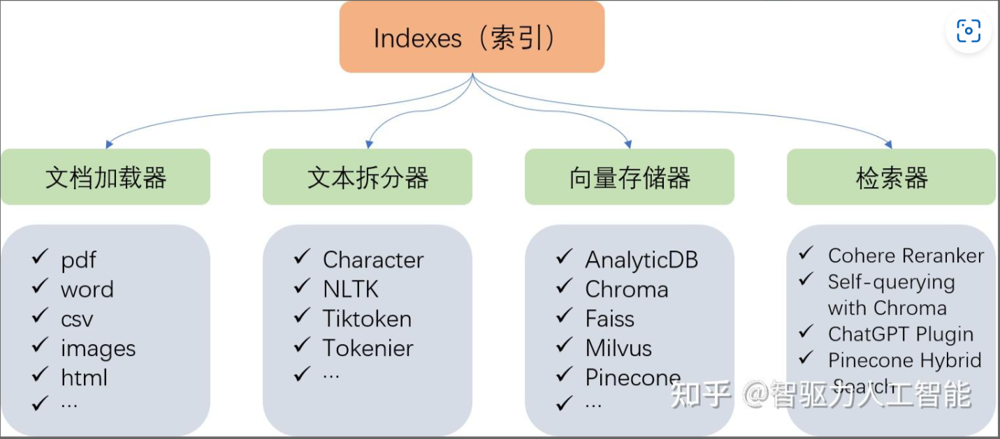
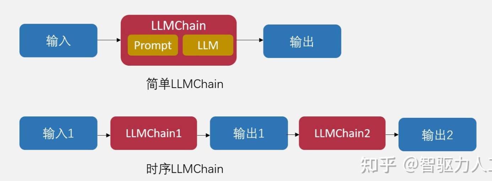
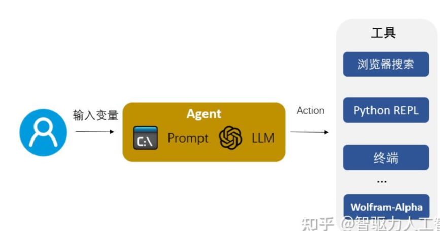
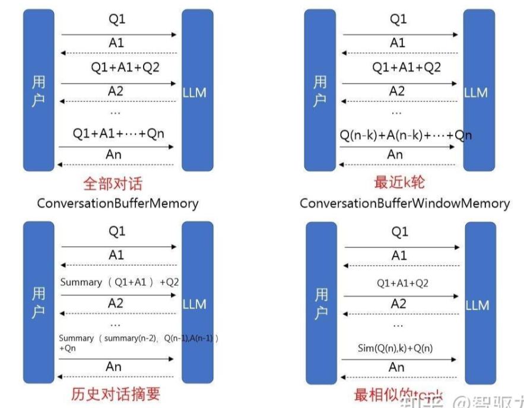
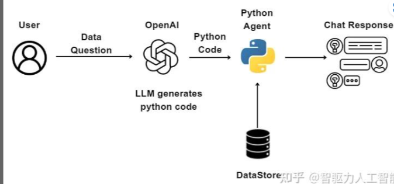
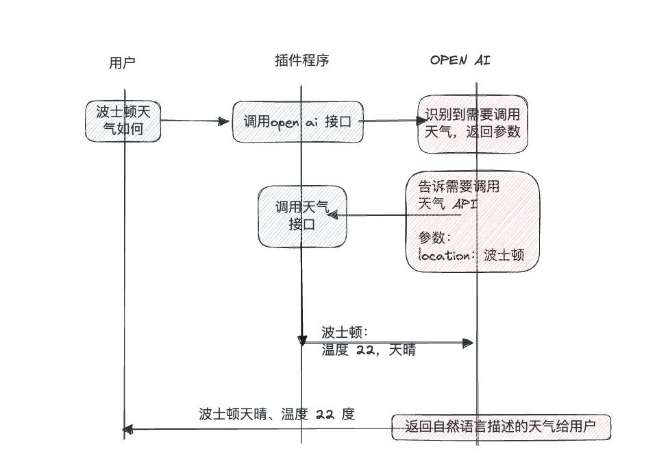

#! https://zhuanlan.zhihu.com/p/642146491

- [AI: 2023.06](#ai-202306)
- [1. 工具](#1-工具)
  - [1.01. 北大 ChatLaw](#101-北大-chatlaw)
  - [1.02. 自然语言 搜索 HuggingFace模型](#102-自然语言-搜索-huggingface模型)
  - [1.03. `MathTranslate` 翻译 Latex 成 中文PDF](#103-mathtranslate-翻译-latex-成-中文pdf)
  - [1.04. 普林斯顿：`Infinigen` 程序生成虚拟场景](#104-普林斯顿infinigen-程序生成虚拟场景)
  - [1.05. `WhisperX`: 音频识别 \& 翻译](#105-whisperx-音频识别--翻译)
- [2. 项目 / 框架](#2-项目--框架)
  - [2.01. Replicate 提供 Stable Diffuse API](#201-replicate-提供-stable-diffuse-api)
  - [2.02. Huggingface Transformer 2.0](#202-huggingface-transformer-20)
  - [2.03. 微软 guidance](#203-微软-guidance)
  - [2.04. `ReliableGPT`](#204-reliablegpt)
  - [2.05. `Diffusers`: 预训练扩散模型库](#205-diffusers-预训练扩散模型库)
  - [2.06. `Vercel AI SDK`: JS版的`LangChain`](#206-vercel-ai-sdk-js版的langchain)
- [3. 模型](#3-模型)
  - [3.01. OpenAI 进展](#301-openai-进展)
  - [3.02. Azure OpenAI API](#302-azure-openai-api)
  - [3.03. `LTM-1` 5000K Token](#303-ltm-1-5000k-token)
- [4. 技巧 / 教程](#4-技巧--教程)
  - [4.01 《思维树 ToT》](#401-思维树-tot)
  - [4.02. 《构筑大语言模型应用：应用开发与架构设计》](#402-构筑大语言模型应用应用开发与架构设计)
  - [4.03. 《Github Copilot 逆向分析》](#403-github-copilot-逆向分析)
  - [4.04. 《60行NumPy手搓GPT》](#404-60行numpy手搓gpt)
  - [4.05. 常识：关于 Token](#405-常识关于-token)
  - [4.06. 阮一峰: 《如何免费使用 ChatGPT》](#406-阮一峰-如何免费使用-chatgpt)
  - [4.07. 《Langchain：LLM应用构建全解析》](#407-langchainllm应用构建全解析)
  - [4.08. OpenAI API 温度](#408-openai-api-温度)
  - [4.09. OpenAI: Function Call](#409-openai-function-call)
- [5. 资讯 / 观点](#5-资讯--观点)
  - [5.01. `WizardCoder`: 编程任务仅次于GPT](#501-wizardcoder-编程任务仅次于gpt)
  - [5.02. 产品 之 Build \& Sell](#502-产品-之-build--sell)
  - [5.03. `Demo` 如果《虚拟人生》游戏能接入现代先进的AI技术会怎么样？](#503-demo-如果虚拟人生游戏能接入现代先进的ai技术会怎么样)
  - [5.04. 《UI-任务处理》](#504-ui-任务处理)
  - [5.05. DeepMind《自然》用`AlphaDev`发现了更快的排序算法](#505-deepmind自然用alphadev发现了更快的排序算法)

# AI: 2023.06

# 1. 工具

## 1.01. [北大 ChatLaw](https://github.com/PKU-YuanGroup/ChatLaw)

来自北京大学ChatExcel课题组开源的中文法律大模型ChatLaw，极大的解决了GPT的幻觉问题。

+ ChatLaw-13B：这是基于姜子牙Ziya-LLaMA-13B-v1（一个基于LLaMA 13B针对中文优化的微调的版本 网页链接）训练，这个版本中文支持很好，但是受模型参数大小的限制，逻辑能力相对较弱
+ ChatLaw-33B：这是基于Anima（一个开源的基于QLoRA的33B中文大语言模型github.com/lyogavin/Anima）训练的版本，逻辑推理能力比较强，但是由于Anima中文语料不足，问答时经常会出现中文数据
+ ChatLaw-Text2Vec：使用了93万条判决案例做成的向量数据集，基于BERT训练的相似度匹配模型，可以根据用户提问的内容检索到最相关的法律条文。

## 1.02. [自然语言 搜索 HuggingFace模型](https://huggingface.co/spaces/anzorq/hf-spaces-semantic-search)

通过自然语言，快速检索 HuggingFace 各种模型。

通过这种方式，我们可以挖掘到各类「图像生成」、「文档智能对话」、「AI 视频合成」等实用的 AI 模型。

## 1.03. [`MathTranslate` 翻译 Latex 成 中文PDF](https://zhuanlan.zhihu.com/p/633316249)

## 1.04. [普林斯顿：`Infinigen` 程序生成虚拟场景](https://github.com/princeton-vl/infinigen)

普林斯顿刚开源了一个（开源免费的）元宇宙创世神器！`Infinigen`，用程序化的方式一键生成超逼真/多样化/UE5级别的虚拟场景！

感觉一下子解决了ACG场景生成 / 虚拟场景标注数据集生成两大问题，但是最大遗憾是目前所有场景几乎是随机生成的，如果将随机生成的代码和对应的场景之间加上人工对于这些场景的文字描述，构建一个“文字描述—虚拟实感场景模型—程序化代码+参数”的训练集，然后train一个 text 2 scene的AI，以后直接文字描述生成完备的三维拟真场景，这个未来简直不敢想象！

+ 程序化：Infinigen 不是有限的 3D 资产或合成图像集合，而是一个可以生成无限多不同形状、纹理、材质和场景组合的生成器。所以理论上可以生成无限多无限丰富的场景。
+ 完备性：Infinigen 提供了涵盖自然世界中各种物体和场景的广泛内容，包括植物、动物、地形以及火、云、雨和雪等自然现象。
+ 真实几何mesh：与视频游戏资产中通常使用纹理贴图来伪造几何细节（如表面看起来崎岖但实际上是平坦）不同，Infinigen 中所有几何mesh细节都是真实的。
+ 可转换构建虚拟数据集：由于最终数据的完备性，生成的场景很容易转换为法线、深度、目标检测、实例分割等多种配对数据集。
+ 自由且开源：Infinigen 基于 Blender构建。Infinigen 的代码在 GPL 许可下免费发布。粗看论文，好像是先生成几何节点，再从几何节点转为python？

## 1.05. [`WhisperX`: 音频识别 & 翻译](https://github.com/m-bain/whisperX)

web版本见 [这里](https://huggingface.co/spaces/Xenova/whisper-web)

这个程序的特点是可以按照单词对齐时间戳，所以基本上生成的字幕都是完整的句子。生成结果除了srt还有json文件，里面有每一行里面单词的时间戳，可以根据需要二次整理字幕。另外它还能识别发言人，准确率还可以。需要NVIDIA的显卡，好在Google Colab可以运行（需要启用GPU）。

好处是，如果你不想从头看几个小时的课程，可以先弄字幕翻译，然后 先看字幕，有不懂的再回头看对应的画面。这样能节省时间，否则几个小时的视频，很多多是你懂的东西，听也难不听也可惜。

[这里](https://github.com/JimLiu/whisper-subtitles/blob/main/whisperx_youtube_subtitle.ipynb)是个demo，根据YouTube Url识别YouTube字幕的Jupyter Notebook

# 2. 项目 / 框架

## 2.01. [Replicate 提供 Stable Diffuse API](https://replicate.com/)

[对比 Stability.ai 的 API 的 差异](https://www.similarweb.com/website/replicate.com/vs/stability.ai/#traffic)

注：不同的模型需要在不同的硬件运行，要查看demo和文档

三选一，具体看模型

+ `CPU`: $0.0002/秒；0.012/分
+ `NV T4`: $0.00055/秒; $0.033/分
+ `A100` 40GB: $0.0023/秒; $0.138/分

例子: 下面模型要在 `A100` 跑，9秒内算完，[mj-v4 类似 模型](https://replicate.com/tstramer/midjourney-diffusion)

## 2.02. [Huggingface Transformer 2.0](github.com/xenova/transformers.js/)

Transformers 2.0 版本发布。

现在，你可以直接在 Web 浏览器上运行 HuggingFace Transformers，实现各种 AI 功能了。

仅需 3 行 JavaScript 代码，即可快速集成使用。

该项目现已支持执行以下 AI 任务：

+ 📝 NLP：文本分类、摘要、翻译和文本生成 
+ 🖼️ 视觉：图像分类、对象检测和分割 
+ 🗣️ 音频：自动语音识别 
+ 🐙 多模态：零示例图像分类

## 2.03. [微软 guidance](https://github.com/microsoft/guidance)

微软的 Guidance 对 prompt 的约束性做到了可编程的规范化，可轻松实现 JSON 格式输出、自定义格式输出等。

看起来就像是一个模板函数，变量部分可完全由 LLM 来补全，支持在模板中使用循环、函数、条件判断等编程逻辑来编排输出结果。 ​​​

## 2.04. [`ReliableGPT`](https://github.com/BerriAI/reliableGPT) 

解决 OpenAI 服务器：

+ API 错误
+ API 超时
+ 速率限制 错误
+ 服务 不可用 错误/过载
+ 上下文窗口 错误
+ 无效的 API 密钥错误

处理过程：

+ 失败重试策略（下面是可选策略）
    - 可指定 fallback_strategy=['gpt-3.5-turbo', 'gpt-4', 'gpt-3.5-turbo-16k', 'text-davinci-003']；遇到错误，则按给定顺序重试，直到收到有效响应。
+ 指定备份API-KEY：在多个服务器上使用 OpenAI 密钥
+ Context 溢出：会自动使用具有较大上下文窗口的模型重试您的请求

## 2.05. [`Diffusers`: 预训练扩散模型库](https://github.com/huggingface/diffusers)

Diffusers v0.17.0 正式发布，改进了 LoRA、Kandinsky 2.1、Torch 编译加速等特性。

Diffusers是预训练扩散模型的首选库，可用于生成图像、音频，甚至分子的 3D 结构。

无论你是在寻找简单的推理解决方案还是训练自己的扩散模型，Diffusers 均可作为模块化工具箱提供支持。

该库设计重在可用性与可定制性，主要提供以下 3 个核心组件：

- 最先进的扩散管道，只需几行代码即可在推理中运行；
- 可互换的噪声调度器，用于不同的扩散速度和输出质量；
- 预训练模型可用作构建块，并与调度程序结合使用，用于创建自己的端到端扩散系统。

## 2.06. [`Vercel AI SDK`: JS版的`LangChain`](https://github.com/vercel-labs/ai)

Vercel发布了Vercel AI SDK，简直就是前端版的`LangChain`

支持多种LLM，支持Stream

提供了一个名字为“ai”的npm包，运行 npm install ai 加到 前端项目。

现已集成 OpenAI、Hugging Face、LangChain 等知名 AI 开发工具。未来 AI 应用的开发效率将越来越快，成本越来越低。

目前已支持 React/Next.js、Svelte/SvelteKit，下一步将支持 Nuxt/Vue。

# 3. 模型

## 3.01. OpenAI 进展

目前问题焦点: 缺乏 GPU

Roadmap:

+ 2023年
    - 更便宜、更快的 GPT-4
    - 更多 token
    - 微调 api
    - 有状态的 API
+ 2024年
    - 多模态

具体：

+ 5月中旬，发布 iOS App
+ 2023.06.13 发布 新API
    - 16k 上下文 3.5 Turbo 模型
    - Function Call，等价于 Agent
    - V2 嵌入模型 降价 75%
+ 2023.07.07
    - GPT4 API 全面开放；
    - 以下 API 也全面开放: GPT-3.5 Turbo / DALL·E / Whisper
    - 2024.06.13 以后会废弃 gpt-3.5-turbo-0301、gpt-4-0314 和 gpt-4-32k-0314
+ 2023.07.09
    - GPT Plus 订阅 可以 使用 [代码解释器](https://mp.weixin.qq.com/s/K_csi1oWDv5tEaeeKSlvwA) 插件
    - 暂停 ChatGPT插件 使用 浏览器
+ 2023.07.21
    - 新功能 Custom instructions（自定义指令），可以事先定义 Prompt 设置自己的背景信息，以及期望的ChatGPT输出格式。
    - ChatGPT发布官方 安卓版App
+ 2023.08.01
    - 发布 GPTBot，爬虫；
+ 2023.08.22
    - GPT-3.5微调 API，可以基于GPT-3.5微调自己模型，可以多出来很多应用场景，比如以前你做客服机器人，需要大量的Prompt来做in-context-learning，现在可以直接微调到模型中，少用很多Prompt。
    - 价格：是 GPT-3.5 的 10倍，GPT-4 的 1/2。

## 3.02. [Azure OpenAI API](https://51.ruyo.net/18402.html)

需要：企业邮箱，企业官网；

+ （截至 2023.06）可能是国内唯一没有风控的`OpenAI API`付费渠道
+ 企业邮箱：最快的是使用 腾讯 的 企业邮箱； 如果考虑到使用 海外接口 的 安全问题，可以使用 `aws`
+ [点这里](https://docs.aws.amazon.com/zh_cn/workmail/latest/adminguide/howto-start.html)：申请 `aws`账号；在`aws`买域名；按流程注册邮箱

`Cursor`作者`Aman Sanger`测试，使用 `Azure` 的 `completion` 模式，而不是 OpenAI 的 chat 模式时，性能 可从 < 50% 跃升到 74%

+ median latency从15秒减少到3秒
+ 95th percentile latency从60秒减少到15秒
+ 平均每秒处理的token数量增加了三倍，从 8 个增加到 24 个。

## 3.03. [`LTM-1` 5000K Token](https://weibo.com/1727858283/N4hBhEhgf)

LTM-1的LLM 支持最大500万Tokens，也就是5000K

比之前Claude的100K还多50倍，一本长篇小说都没问题了。

LTM-1 使用 LTM Net（Long-term Memory Network）的技术

# 4. 技巧 / 教程

## 4.01 [《思维树 ToT》](https://zhuanlan.zhihu.com/p/633974673)

+ CoT 思维链
+ ToT 思维树

## 4.02. [《构筑大语言模型应用：应用开发与架构设计》](https://aigc.phodal.com/?continueFlag=785b1b86603c0b46a030ec215edcaf12)

## 4.03. [《Github Copilot 逆向分析》](https://github.com/mengjian-github/copilot-analysis)

## 4.04. [《60行NumPy手搓GPT》](https://jiqihumanr.github.io/2023/04/13/gpt-from-scratch/)

LLM大行其道，然而大多数GPT模型都像个黑盒子一般隐隐绰绰，甚至很多人都开始神秘化这个技术。译者觉得直接跳进数学原理和代码里看看真实发生了什么，才是最有效的理解某项技术的方法。

这篇文章细致的讲解了GPT模型的核心组成及原理，并且用Numpy手搓了一个完整的实现（可以跑的那种），读起来真的神清气爽。项目代码也完全开源，叫做picoGPT(pico，果然是不能再小的GPT了)。

## 4.05. 常识：[关于 Token](https://platform.openai.com/tokenizer)

+ 统计上，1K token 约为 750个 英文单词 (3/4)，500个 中文汉字 (1/2)
+ GPT API，收费 Token = 问题 Token  + 答案 Token。
+ 截至 2023.06，GPT-4 API 价格 几乎是 GPT-3.5 价格 的 20倍。
    - 8K 上下文 的 GPT-4: 问题 约 ￥0.2 / 1K-Token，答案 约 ￥0.4 / 1K-Token

## 4.06. [阮一峰: 《如何免费使用 ChatGPT》](http://www.ruanyifeng.com/blog/2023/06/weekly-issue-259.html)

+ [Github 网址 1](https://github.com/LiLittleCat/awesome-free-chatgpt)
+ [Github 网址 2](https://github.com/lzwme/chatgpt-sites)
+ [Github 网址 3](https://github.com/xxxily/hello-ai/blob/main/home/FreeChatGPTSiteList.md)
+ [FreeGPT WebUI & gpt4free](https://github.com/ramonvc/freegpt-webui)

FreeGPT WebUI 是 [gpt4free](https://github.com/xtekky/gpt4free) 的ui界面，主要作用 是 无需API-KEY 也 无需代理IP 就可以 访问 GPT3.5 / GPT4

+ 无需API-KEY: 为 [gpt4free](https://github.com/xtekky/gpt4free) 提供gui界面
+ 无需代理IP: 为有需要的用户搜集免费的 代理IP，默认30分钟 更新一次

**注：** [gpt4free](https://github.com/xtekky/gpt4free) 流程是：到给定网站访问非公开API，间接的访问 GPT3.5 / 4

## 4.07. [《Langchain：LLM应用构建全解析》](https://zhuanlan.zhihu.com/p/633288551)













## 4.08. [OpenAI API 温度](https://weibo.com/6444741184/N6kmpbW8k)

我们在调用LLM的API时，有时候需要调整温度(temperature)参数，这个参数有什么用呢？

在Google的“生成式AI学习”课程的“Encoder-Decoder Architecture: Overview 编码器-解码器架构”这期视频里面，里面谈到了temperature参数的作用。

如果温度很高，它会使得所有Token的得分变得接近于0，这意味着这个Token更有可能被选中。会有更多的多样性，更多的内容可以被预测，这会使得模型变得更有创造性。但如果温度太高，神经网络只会预测出无意义的东西。

如果温度非常低，最高的概率得分会被乘以一个非常大的数，这会使得最高得分的Token有更大的被选中的概率，也就是说，模型的行为会更加确定。

## 4.09. [OpenAI: Function Call](https://weibo.com/1727858283/N5cAnc3J8)

本质上是OpenAI让API直接支持了Agent或者Plugin！

以前你需要通过Prompt里面加一堆描述支持Agent，现在简单多了，只要在API请求的时候，传入一个functions参数。

functions参数实际上就类似于你要指定的Agent。

注意是functions参数一个数组，也就是可以不止一个function，function是一个对象，可以加上：
name：名称
description：描述，这个很重要，因为GPT需要通过描述来决定是不是用这个函数。
parameters：参数数组，有参数的名字和类型，以及说明

然后返回的结果包含了结构化的内容：
function_call：调用的函数名，和你传入的函数名称一致
arguments：JSON格式的参数值，包含了你调用函数需要的参数名称和值。

例如：
"function_call": { "name": "get_current_weather", "arguments": "{ \"location\": \"Boston, MA\"}" }

我认为function最大的价值是解决了GPT返回数据结构化的问题，不再需要你写复杂的prompt，传入function，你可以保证得到一个跟你的function完全匹配的JSON数据，减少了很多出错和重试的成本！

[如何利用`OpenAI Function Calling` 解析递归机构](https://weibo.com/1727858283/4914861421363777)

`OpenAI`的`Function Calling`的 parameters 说明是基于`JSON schema`规范的

`JSON Schema`里面有一个特殊的关键字叫`$ref`

``` JSON

"children": {
  "type": "array",
  "description": "The tree nodes",
  "items": { "$ref": "#" }
}
```

[OpenAI: Function calling 函数调用实例](https://twitter.com/ProgramerJohann/status/1668812508608724994)



解决命题： 波士顿的天气如何：

1. 构造

【请求体】：

user ："What is the weather like in Boston?"

functions（新增的 endpoint和message同级）：定义清楚需要调用的函数的名字、入参（包括他的类型）。

例如这里的函数名（get_current_weather），入参（location）

【返回】

assistant： 函数名（get_current_weather），参数（"{ \"location\": \"Boston, MA\"}"）

2. 调用函数

通过上面的返回函数名，我们调用代码里面的 get_current_weather 请求天气 API，然后返回 【温度22度，天气晴】

3. 发送结果给 open AI

在步骤1 的 messages 内，补充 2 个 role， 一个是 assistant ，一个是 function，分别对应上面步骤 1 和步骤 2 的返回。

最终 openai 输出

assistant：The weather in Boston is currently sunny with a temperature of 22 degrees Celsius.

# 5. 资讯 / 观点

## 5.01. [`WizardCoder`: 编程任务仅次于GPT](https://www.jiqizhixin.com/articles/2023-06-20-5)


## 5.02. 产品 之 Build & Sell


## 5.03. `Demo` [如果《虚拟人生》游戏能接入现代先进的AI技术会怎么样？](https://weibo.com/1727858283/N7CZG9P0m)

第一部分 回顾了《虚拟人生》这类虚拟伴侣游戏的历史

第二部分 重点探讨了将AI接入虚拟伴侣类游戏的可能。

## 5.04. [《UI-任务处理》](https://arxiv.org/abs/2306.00245)

通过基于像素的预训练和树搜索方法，成功创建了能用屏幕截图和通用动作空间与数字世界进行交互的智能体程序，并在GUI指令遵循任务中取得了优秀的性能。

## 5.05. [DeepMind《自然》用`AlphaDev`发现了更快的排序算法](https://weibo.com/2194035935/N4kyOexoc) 

+ [Understanding DeepMind's Sorting Algorithm](https://justine.lol/sorting)
+ [知乎：平凡 的回答](https://www.zhihu.com/question/605448432/answer/3064901439)

优化的不是排序算法；是优化汇编指令的排列组合，找最优解；（用AI解决组合优化问题）

deepmind在nature上发布了一篇重磅文章《Faster sorting algorithms discovered using deep reinforcement learning》使用深度强化学习发现更快的排序算法 

之前deepmind用AlphaZero来玩围棋玩到独孤求败，现在他们用类似的思路开发了一个 AlphaDev。 AlphaDev从零开始发现了一些小的排序算法，这些算法的性能超过了以前已知的人类基准，特别是对于短序列，速度可以提高70%。这些算法已经集成到LLVM标准C++排序库中。 

之后AlphaDev被用来尝试发现更快的哈希算法。目前的结果是当将其应用于 9-16 字节范围的哈希函数时，AlphaDev 发现的算法速度提高了 30%。

不是直接优化C代码，而是去优化C生成的汇编代码，最后再逆向为C代码。所以理论上可能将来这些基础算法的代码也会变得人类不可理解了。

后续：[GPT-4 我也能上《自然》啊](https://www.qbitai.com/2023/06/60017.html)

DeepMind新AI登上Nature才一天，GPT-4就来打擂台了！

只通过两段提示，GPT-4就给出了和AlphaDev如出一辙的排序算法优化方法。

而AlphaDev被DeepMind称作是“重现AlphaGo神来之笔”，发现了提速70%的排序算法。
