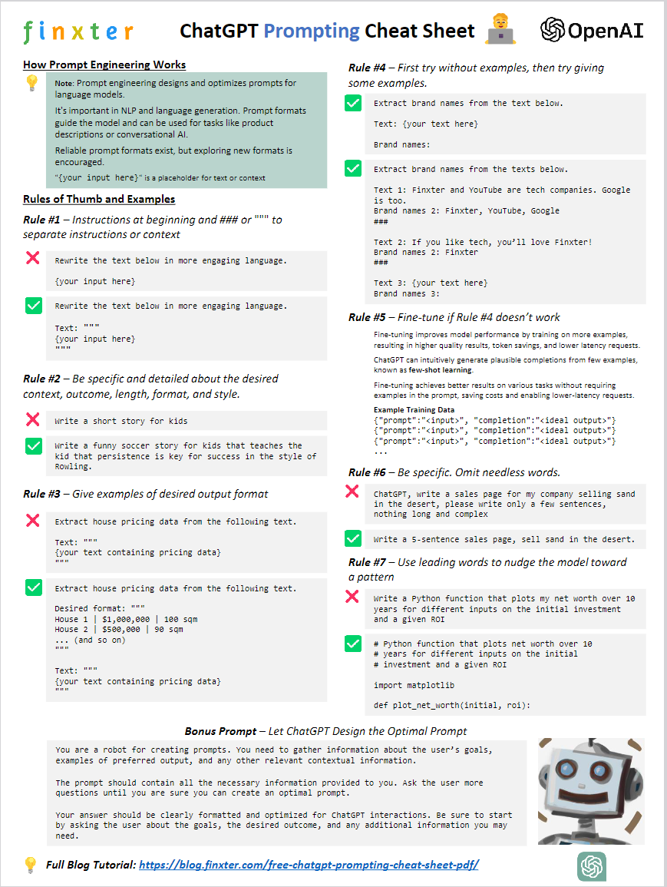
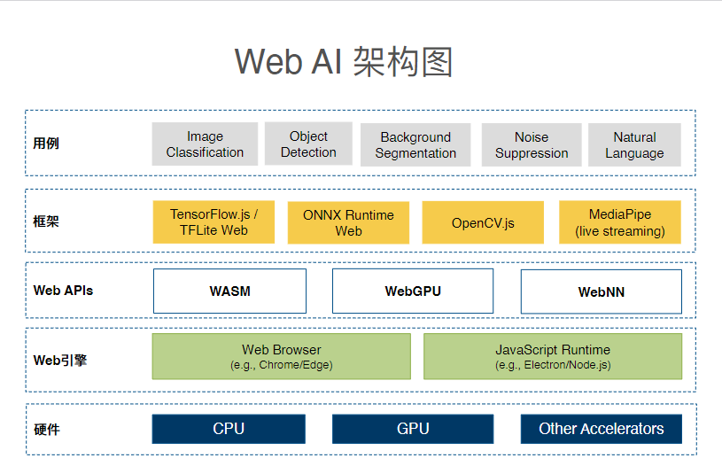

- [AI: 2023.08](#ai-202308)
- [1. 工具](#1-工具)
  - [1.01. `Perplexity.ai` 支持上传文件，联网搜索，给引用来源，幻觉很少](#101-perplexityai-支持上传文件联网搜索给引用来源幻觉很少)
  - [1.02. `Pixellab.ai`: 草图 / 线稿 变 像素插画](#102-pixellabai-草图--线稿-变-像素插画)
  - [1.03. `ToolLLM`：利用大型语言模型掌握 16000 多个真实世界的 API](#103-toolllm利用大型语言模型掌握-16000-多个真实世界的-api)
  - [1.04. 基于MovieChat视频理解的问答，能够在24GB显卡上处理10K帧视频](#104-基于moviechat视频理解的问答能够在24gb显卡上处理10k帧视频)
  - [1.05. 将google地图 3D模型 导入 Blender](#105-将google地图-3d模型-导入-blender)
  - [1.06. Meta开源了 AudioCraft：文本 -- 声音](#106-meta开源了-audiocraft文本----声音)
  - [1.07. PrettyPolly.app](#107-prettypollyapp)
  - [1.08. FlowGPT: 提示词](#108-flowgpt-提示词)
  - [1.09. Figma插件：矢量图 变 3D](#109-figma插件矢量图-变-3d)
  - [1.10. Lalamu Studio：创建口型同步视频](#110-lalamu-studio创建口型同步视频)
  - [1.11. 生成logo的 SD v1.5 微调模型](#111-生成logo的-sd-v15-微调模型)
  - [1.12. GPTBot: OpenAI 网络爬虫](#112-gptbot-openai-网络爬虫)
  - [1.13. 国内 AI 产品搜索](#113-国内-ai-产品搜索)
  - [1.14. 语音模型 PlayHT2.0](#114-语音模型-playht20)
- [2. 项目 / 框架](#2-项目--框架)
  - [2.01. LLaMA2-Accessory：LLM 开发的开源工具包](#201-llama2-accessoryllm-开发的开源工具包)
  - [2.02. USearch：单文件向量搜索引擎](#202-usearch单文件向量搜索引擎)
  - [2.03. 斯坦福大学 “AI数字人小镇 "正式开源](#203-斯坦福大学-ai数字人小镇-正式开源)
  - [2.04. a16z: 斯坦福25个AI小人虚拟小镇 用 js  重写开源](#204-a16z-斯坦福25个ai小人虚拟小镇-用-js--重写开源)
  - [2.05. Madrona：基于GPU加速的高吞吐模拟器的原型游戏引擎](#205-madrona基于gpu加速的高吞吐模拟器的原型游戏引擎)
  - [2.06. 自动训练 的 AI Agent](#206-自动训练-的-ai-agent)
  - [2.07. VirtualWife: 虚拟主播项目，目前支持在B站进行直播](#207-virtualwife-虚拟主播项目目前支持在b站进行直播)
  - [2.08. FaceChain：打造个人数字形象的深度学习模型工具](#208-facechain打造个人数字形象的深度学习模型工具)
  - [2.09. AgentSims: 用于 LLM 评估的开源沙盒](#209-agentsims-用于-llm-评估的开源沙盒)
  - [2.10. 用AI生成高质量电子书](#210-用ai生成高质量电子书)
  - [2.11. AI Town：适合自己构建和定制的AI小镇JS入门套件——一个虚拟小镇](#211-ai-town适合自己构建和定制的ai小镇js入门套件一个虚拟小镇)
- [3. 模型](#3-模型)
  - [3.01. 把LLaMA-2的上下文扩展到32K](#301-把llama-2的上下文扩展到32k)
  - [3.02. 阿里: Qwen-7B 通义千问 开源版](#302-阿里-qwen-7b-通义千问-开源版)
  - [3.03. 中文LLaMA-2 \& Alpaca-2 LLM](#303-中文llama-2--alpaca-2-llm)
  - [3.04. Nvidia: 文生图 模型：Perfusion](#304-nvidia-文生图-模型perfusion)
  - [3.05. 高质量唇形合成](#305-高质量唇形合成)
  - [3.06. DoctorGPT，基于 Llama2 7B 的 3GB 医疗模型](#306-doctorgpt基于-llama2-7b-的-3gb-医疗模型)
  - [3.07. Meta MuAViC: 语音识别+翻译 针对背景嘈杂 做优化](#307-meta-muavic-语音识别翻译-针对背景嘈杂-做优化)
  - [3.08. SwiftWhisper](#308-swiftwhisper)
- [4. 技巧 / 教程](#4-技巧--教程)
  - [4.01. 《深度学习需要的`矩阵微积分`》](#401-深度学习需要的矩阵微积分)
  - [4.02. 《llama2.c手把手代码解析》](#402-llama2c手把手代码解析)
  - [4.03. 《图解 transformer》](#403-图解-transformer)
  - [4.04. 《可视化解释Stable Diffusion的工作原理》](#404-可视化解释stable-diffusion的工作原理)
  - [4.05. 《结构化 Prompt》](#405-结构化-prompt)
  - [4.06. 《LLM简明概述》：解释了大型语言模型(LLM)的工作原理](#406-llm简明概述解释了大型语言模型llm的工作原理)
  - [4.07. 提示 图解](#407-提示-图解)
  - [4.08. 如何微调 Transformer](#408-如何微调-transformer)
  - [4.09. 构建基于LLM的系统和产品的模式](#409-构建基于llm的系统和产品的模式)
  - [4.10. 常识：英伟达显卡，从旧到新](#410-常识英伟达显卡从旧到新)
- [5. 资讯 / 观点](#5-资讯--观点)
  - [5.01. Inworld AI：将游戏的NPC进行AI化](#501-inworld-ai将游戏的npc进行ai化)
  - [5.02. 资讯：Inworld 与 ElevenLabs 合作为《侠盗猎车手V》提供 AI NPC 和 AI 声音](#502-资讯inworld-与-elevenlabs-合作为侠盗猎车手v提供-ai-npc-和-ai-声音)
  - [5.03. 观点: 《编程的未来 - 还有未来么》](#503-观点-编程的未来---还有未来么)
  - [5.04. 观点: 你能简单地给LLM洗脑吗？](#504-观点-你能简单地给llm洗脑吗)
  - [5.05. 观点：科学思考的能力是智力的本质吗？](#505-观点科学思考的能力是智力的本质吗)
  - [5.06. 资讯：NVIDIA DGX Cloud 将可通过 HuggingFace访问，为企业创建和定制生成式 AI模型](#506-资讯nvidia-dgx-cloud-将可通过-huggingface访问为企业创建和定制生成式-ai模型)
  - [5.07. 资讯：移动App：不备案不能上网](#507-资讯移动app不备案不能上网)
  - [5.08. 资讯：Nvidia FlexiCubes：使用生成式 AI 创建 3D 网格](#508-资讯nvidia-flexicubes使用生成式-ai-创建-3d-网格)
  - [5.09. 资讯：WebAI 开始 草稿](#509-资讯webai-开始-草稿)

# AI: 2023.08

# 1. 工具

## 1.01. [`Perplexity.ai` 支持上传文件，联网搜索，给引用来源，幻觉很少](https://www.perplexity.ai)

可以免费试用大概5次。

## 1.02. [`Pixellab.ai`: 草图 / 线稿 变 像素插画](https://weibo.com/1727858283/Ncrax4uAC)

## 1.03. [`ToolLLM`：利用大型语言模型掌握 16000 多个真实世界的 API](https://github.com/OpenBMB/ToolBench)

该项目（ToolLLM）旨在构建开源、大规模、高质量的指令调优SFT数据，以方便构建具有通用工具使用能力的强大LLM。目标是让开源LLM能够掌握数千个不同的现实世界 API。项目通过收集高质量的指令调整数据集来实现这一目标。它是使用最新的ChatGPT（gpt-3.5-turbo-16k）自动构建的，并通过增强的函数调用能力进行了升级。项目提供数据集、相应的训练和评估脚本，以及在 ToolBench 上微调的强大模型 ToolLLaMA。

## 1.04. [基于MovieChat视频理解的问答，能够在24GB显卡上处理10K帧视频](https://github.com/rese1f/MovieChat)

## 1.05. [将google地图 3D模型 导入 Blender](https://twitter.com/xiaohuggg/status/1673192327551258624)

Imagiscope Tech 公司 开发插件，将全球任何地方的Google Earth的3D数据导入到Blender中。

用户只需设置位置，模型就会直接导入到场景中。

然后你就可以在Blender中轻松调整。

这对于需要在真实环境中进行建模的项目（如城市规划、GIS分析、电影和游戏设计等）非常有用。

## 1.06. [Meta开源了 AudioCraft：文本 -- 声音](https://ai.meta.com/blog/audiocraft-musicgen-audiogen-encodec-generative-ai-audio)

试用 MusicGen: huggingface.co/spaces/facebook/MusicGen

AudioCraft 框架，在对原始音频信号（而不是 MIDI 或钢琴卷轴）进行训练后，根据基于文本的用户输入生成高质量、逼真的音频和音乐。

AudioCraft 包含三个模型：MusicGen、AudioGen和EnCodec。MusicGen 使用 Meta 拥有且专门授权的音乐进行训练，根据基于文本的用户输入生成音乐，而 AudioGen 使用公共音效进行训练，根据基于文本的用户输入生成音频。今天，Meta发布了 EnCodec 解码器的改进版本，它可以用更少的音损生成更高质量的音乐；预先训练的 AudioGen 模型，可让你生成环境声音和声音效果，例如狗叫声、汽车喇叭声或木地板上的脚步声；以及所有 AudioCraft 模型权重和代码。这些模型可用于研究目的并加深人们对该技术的理解。

## 1.07. [PrettyPolly.app](https://www.prettypolly.app/)

学习外语时，最好有一个对话环境，可以练习口语。现在有一个 AI 应用，解决了这个问题。

它目前提供26种语言（包括中文、日文和韩文），你在网页上选择一种，就可以与 AI 进行口语练习了。

## 1.08. [FlowGPT: 提示词](https://flowgpt.com)

以开源社区运作方式聚集了上百万的 Prompt Engineers，在上面有逛到非常多实用的 Prompts。

网站还提供了免费的 ChatGPT 调试能力，方便你对 Prompt 做编写、测试、发布和管理工作，发布出来的 Prompt 可以被其他人直接执行使用，有点类似 Prompt as a Service，十分便捷。

另外，也可以去看看热门的 Prompt，学习下他们是如何编写的，原来写 Prompt 有这么多黑魔法。

## 1.09. [Figma插件：矢量图 变 3D](https://twitter.com/xiaohuggg/status/1688011561322045440)

## 1.10. [Lalamu Studio：创建口型同步视频](https://twitter.com/i/status/1688058582527574017)

上传视频文件或使用模板，AI将自动调整口部动作以匹配音频。

你也可以上传自己的音频文件来匹配。同时支持文本转语音功能，可以将文本转换为语音再匹配口型。

目前只是试用版，仅德语和英语的文本转语音功能。后面陆续将支持更多语言。

## 1.11. [生成logo的 SD v1.5 微调模型](https://huggingface.co/iamkaikai/amazing-logos-v2)

## 1.12. [GPTBot: OpenAI 网络爬虫](https://platform.openai.com/docs/gptbot)

从互联网上抓取数据以训练未来AI。提醒:若不

希望GPTBot访问网站，可加入robots.txt。

## 1.13. [国内 AI 产品搜索](https://ai.dreamthere.cn/)

## 1.14. [语音模型 PlayHT2.0](https://news.play.ht/post/introducing-playht2-0-the-state-of-the-art-generative-voice-ai-model-for-conversational-speech)

该模型经过训练和构建以生成对话语音。该模型还首次将情感概念引入生成语音AI，让你可以控制和指导具有特定情感的语音的生成。

该模型已内测，并将通过 API 和PlayHT的 Studio 进行访问。

PlayHT2.0将模型大小增加了 10 倍，并将数据集增加到超过 100 万小时的跨多种语言、口音和说话风格的语音

- 类似人类的对话能力
- 实时语音生成
- 即时语音克隆
- 跨语言和口音克隆
- 理解情绪并能生成带情绪的语音

# 2. 项目 / 框架

## 2.01. [LLaMA2-Accessory：LLM 开发的开源工具包](https://github.com/Alpha-VLLM/LLaMA2-Accessory)

这个repo主要继承自LLaMA-Adapter

LLaMA2-Accessory是一个开源工具包，用于大型语言模型 (LLM)和多模式 LLM的预训练、微调和部署。

+ 💡支持更多数据集和任务
+ 🎯使用RefinedWeb和StarCoder进行预训练。
+ 📚使用Alpaca、ShareGPT、LIMA、UltraChat和MOSS进行单模态微调。
+ 🌈使用图像文本对（ LAION、COYO等）、交错图像文本数据（MMC4和OBELISC）和视觉指令数据（LLaVA、Shrika、Bard）进行多模态微调
+ 🔧API 控制LLM（GPT4Tools和Gorilla）。
+ ⚡高效优化和部署
+ 🚝通过零初始注意和偏差范数调整进行参数高效的微调。
+ 💻完全分片数据并行 ( FSDP )、Flash Attention 2和QLoRA。
+ 🏋️‍♀️支持更多视觉编码器和LLM
+ 👁‍🗨视觉编码器：CLIP、Q-Former和ImageBind。
+ 🧩LLM：LLaMA 和 LLaMA2。

## 2.02. [USearch：单文件向量搜索引擎](http://aicoco.net/s/4h)

支持多种度量方式和编程语言，提供高性能的向量搜索。特点包括支持自定义度量方式、高内存效率、硬件支持范围广泛、可从外部存储加载索引、支持语义搜索和连接等功能。与FAISS相比，USearch在设计原则和性能方面有一些区别

## 2.03. [斯坦福大学 “AI数字人小镇 "正式开源](https://github.com/joonspk-research/generative_agents)

斯坦福小镇Smallville正式开源了！

25个AI代理居住在一个数字化的西部世界中，他们并不知道自己生活在一个模拟环境中。他们上班、聊天、组织社交活动、结交新朋友，甚至坠入爱河。每个人都有独特的个性和背景故事。

## 2.04. [a16z: 斯坦福25个AI小人虚拟小镇 用 js  重写开源](https://github.com/a16z-infra/ai-town)

新的技术栈相对前端友好，NextJS + Tailwind

完整技术栈：

+ 游戏引擎和数据库Game engine & Database: Convex
+ 向量数据库VectorDB: Pinecone
+ 登录认证Auth: Clerk
+ 文字生成模型Text model: OpenAI
+ Deployment: Fly
+ 像素图生成Pixel Art Generation: Replicate, Fal.ai

## 2.05. [Madrona：基于GPU加速的高吞吐模拟器的原型游戏引擎](https://github.com/shacklettbp/madrona)

能在单个GPU上运行成千上万个虚拟环境实例，每秒生成数百万个模拟步骤，这种高效率对于高性能AI智能体的训练(如通过强化学习)或需要将高性能环境模拟器紧密集成到更广泛应用中的任务非常有用。

## 2.06. [自动训练 的 AI Agent](https://github.com/mshumer/gpt-llm-trainer​​)

只需写一句你想训练做什么任务的大模型，一系列AI Agents将为你生成数据集并训练模型。

来自HyperWriteAI创始人Matt Shumer，

## 2.07. [VirtualWife: 虚拟主播项目，目前支持在B站进行直播](https://github.com/yakami129/VirtualWife)

用户可以自由更换VRM人物模型，大家可以将他作为一个虚拟主播入门demo，在上面扩展自己喜欢功能。

## 2.08. [FaceChain：打造个人数字形象的深度学习模型工具](https://github.com/modelscope/facechain)

仅需要提供最低三张照片即可获得独属于自己的个人形象数字替身 

## 2.09. [AgentSims: 用于 LLM 评估的开源沙盒](https://github.com/py499372727/AgentSims)

## 2.10. [用AI生成高质量电子书](https://github.com/easychen/book-by-ai)

## 2.11. [AI Town：适合自己构建和定制的AI小镇JS入门套件——一个虚拟小镇](github.com/a16z-infra/AI-town)

适合自己构建和定制的AI小镇JS入门套件——一个虚拟小镇，AI角色在其中资助生活、聊天和社交

# 3. 模型

## 3.01. [把LLaMA-2的上下文扩展到32K](https://together.ai/blog/llama-2-7b-32k)

`Together.ai`发布了LLaMA-2-7B-32K模型。这个模型在LLaMA-2的基础上把上下文扩展到了32K。

## 3.02. [阿里: Qwen-7B 通义千问 开源版](https://github.com/QwenLM/Qwen-7B)

Qwen-7B是基于Transformer的大语言模型, 在超大规模的预训练数据上进行训练得到。

预训练数据类型多样，覆盖广泛，包括大量网络文本、专业书籍、代码等。

同时，在Qwen-7B的基础上，使用对齐机制打造了基于大语言模型的AI助手Qwen-7B-Chat。

## 3.03. [中文LLaMA-2 & Alpaca-2 LLM](https://github.com/ymcui/Chinese-LLaMA-Alpaca-2)

本项目基于Meta发布的可商用大模型Llama-2开发，是中文LLaMA&Alpaca大模型的第二期项目，开源了中文LLaMA-2基座模型和Alpaca-2指令精调大模型。

这些模型在原版Llama-2的基础上扩充并优化了中文词表，使用了大规模中文数据进行增量预训练，进一步提升了中文基础语义和指令理解能力，相比一代相关模型获得了显著性能提升。

相关模型支持4K上下文并可通过NTK方法最高扩展至18K+。

## 3.04. [Nvidia: 文生图 模型：Perfusion](https://twitter.com/xiaohuggg/status/1687116597385990144)

论文：https://research.nvidia.com/labs/par/Perfusion/

英伟达发布一种新的文本到图像个性化模型：Perfusion

它只需要一个100KB的模型大小，训练大约4分钟，就可以创造性地描绘个性化的对象。

Perfusion模型能够根据输入的文本描述，生成具有特定特征的图像，这些特征可以是物体的颜色、形状、纹理等。同时，保持生成的物体的基本身份不变。

在特定版本的效率方面，超越了SDXL和 MidJourney 等模型！

## 3.05. [高质量唇形合成](https://github.com/ajay-sainy/Wav2Lip-GFPGAN)

## 3.06. [DoctorGPT，基于 Llama2 7B 的 3GB 医疗模型](https://github.com/llSourcell/DoctorGPT)

DoctorGPT 通过美国医师执照考试。离线工作、跨平台，并且你的健康数据保持私密。

大小只有3GB，基于 Llama2 7B，它在医疗对话数据集上进行了微调，然后使用强化学习和Constitutional AI进一步改进。

因此它适合任何本地设备，无需支付 API 即可使用它。

专为离线使用而设计，可以保护患者的隐私，并且可以在 iOS、Android 和 Web 上使用。

## 3.07. [Meta MuAViC: 语音识别+翻译 针对背景嘈杂 做优化](https://ai.meta.com/blog/muavic-audio-visual-speech-translation-benchmark/)

日常生活中，背景噪音会让我们更难理解别人在说什么。所以我们经常使用其他感官的信息，尤其是视觉，比如看嘴唇，来帮助理解。

Meta的“唇读术” MuAViC，这套语音识别+翻译技术特别针对背景嘈杂的情况做了优化，借助面部表情提升语音识别率，思路非常巧妙。

## 3.08. [SwiftWhisper](https://github.com/exPHAT/SwiftWhisper)

SwiftWhisper是基于Whisper.cpp二次封装后，让Swift方便调用的库，基于它可以方便的开发语音识别转文字类的Whisper应用。

# 4. 技巧 / 教程

## 4.01. [《深度学习需要的`矩阵微积分`》](https://explained.ai/matrix-calculus)

## 4.02. [《llama2.c手把手代码解析》](https://github.com/RahulSChand/llama2.c-for-dummies)

## 4.03. [《图解 transformer》](https://jalammar.github.io/illustrated-transformer/)

## 4.04. [《可视化解释Stable Diffusion的工作原理》](https://github.com/poloclub/diffusion-explainer)

## 4.05. [《结构化 Prompt》](https://github.com/yzfly/LangGPT/blob/main/Docs/HowToWritestructuredPrompts.md)

## 4.06. [《LLM简明概述》：解释了大型语言模型(LLM)的工作原理](https://www.understandingai.org/p/large-language-models-explained-with)

首先介绍了词向量的概念，以及它们如何将词汇表示成向量空间中的点，详细介绍了transformer，这是构建LLMs的基本模块，解释了它们如何通过attention机制和前馈网络来理解文本并预测下一个词。

文章还指出LLM的开发方式导致人们目前对其内部工作机制并不完全理解，需要长期研究。

## 4.07. [提示 图解](https://blog.finxter.com/free-chatgpt-prompting-cheat-sheet-pdf/)

## 4.08. [如何微调 Transformer](https://radekosmulski.com/how-to-fine-tune-a-transformer)

## 4.09. [构建基于LLM的系统和产品的模式](https://eugeneyan.com/writing/llm-patterns/)

## 4.10. 常识：英伟达显卡，从旧到新

+ 专业卡：P，A，H，GH；
+ 消费卡：RTX4090，和 H 是 同一代的

# 5. 资讯 / 观点

## 5.01. [Inworld AI：将游戏的NPC进行AI化](https://inworld.ai/experiences)

Inworld AI 是一家专注于游戏和人工智能的初创公司，他们开发了一种名为Inworld的AI角色引擎，它可以将游戏的NPC进行AI化，并可以集成到游戏当中。

这个引擎超越了大语言模型，增加了可配置的安全性、知识、记忆、叙事控制、多模态等功能。

## 5.02. 资讯：Inworld 与 ElevenLabs 合作为《侠盗猎车手V》提供 AI NPC 和 AI 声音

新的《侠盗猎车手V》（Grand Theft Auto V）增加了一个新任务，其中包含30多个NPC，其剧情对话和NPC的声音全部由 AI 生成。

在游戏中，玩家扮演洛圣都警察，调查一个名为NihiAIists的邪教，他们认为自己生活在一个游戏世界中，并崇拜一个AI神灵。

玩家可以与30多个NPC 交谈，但这些对话没有脚本，Bloc也没有雇佣专业配音演员来扮演这些角色。而是使用AI来创建NPC的回应和声音。

Bloc使用了Inworld的Character Engine和ElevenLabs的AI语音服务。

如果您想亲自尝试 Sentient Streets 并了解其 AI 语音的处理方式，可以在 Nexus Mods 上下载。

## 5.03. 观点: [《编程的未来 - 还有未来么》](https://blog.csdn.net/SoftwareTeacher/article/details/131019345)

[ChatGPT编程能力调研报告](https://mp.weixin.qq.com/s/IUifrzt8UINQ9PRDdQ7yPw)

+ 生成的代码长度有限制。 
    - 问程序员: 你参加过的最复杂的项目，总代码量有多少? 能超过一千行代码么?
+ 不能有效处理超长的程序
    - 问程序员:你修复过的最复杂的bug 是什么?
+ 泛化能力有限
    - 问程序员: 你能举一反三么?
+ ChatGPT处理复杂编程中的抽象的“类”和“依赖关系”的能力还比较弱。
    - 问程序员: 你在这方面能力如何? 你写的最复杂的00设计有多少的父类子类?
+ “没有银弹”
    - 问程序员: 你构建过多么复杂的软件，这个软件运行了几年，这几年中你是如何维护这个软件的?
+ 缺乏创造性编程的能力。
    - 问程序员 :你曾经创造性地解决过什么问题?
+ 取决于提问者的能力
    - 问程序员: 你的提问能力如何?

## 5.04. 观点: [你能简单地给LLM洗脑吗？](https://gradientdefense.com/blog/can-you-simply-brainwash-an-llm)

## 5.05. 观点：[科学思考的能力是智力的本质吗？](https://queue.acm.org/detail.cfm?id=3595860)

## 5.06. 资讯：[NVIDIA DGX Cloud 将可通过 HuggingFace访问，为企业创建和定制生成式 AI模型](https://nvidianews.nvidia.com/news/nvidia-and-hugging-face-to-connect-millions-of-developers-to-generative-ai-supercomputing)

+ 每个节点是8×H100或A100。
+ NVIDIA nForce3 Pro 将成为支持大规模扩展的网络技术。
+ NVIDIA Base Command 将成为 DGX Cloud的操作系统。

## 5.07. 资讯：[移动App：不备案不能上网](https://www.miit.gov.cn/zwgk/zcwj/wjfb/tz/art/2023/art_920db564162e4312916a01bed6540ad8.html)

《工业和信息化部关于开展移动互联网应用程序备案工作的通知》

## 5.08. 资讯：[Nvidia FlexiCubes：使用生成式 AI 创建 3D 网格](https://developer.nvidia.com/blog/better-3d-meshes-from-reconstruction-to-generative-ai/)

下一代 AI 管道在生成高保真 3D 模型方面取得了令人难以置信的成功，从生成与给定图像匹配的场景的重建到生成交互式体验资产的生成 AI 管道。

这些生成的 3D 模型通常被提取为标准三角形网格。网格表示提供了许多好处，包括对现有软件包的支持、高级硬件加速以及支持物理模拟。然而，并非所有网格都是平等的，这些好处只有在高质量网格上才能实现。

NVIDIA 最近的研究发现了一种名为 FlexiCubes 的新方法，用于在 3D 管道中生成高质量网格，从而提高一系列应用程序的质量。

## 5.09. [资讯：WebAI 开始 草稿](https://www.w3.org/2023/06/china-web-forum/slides/gu-yang.pdf)

