- [19. GPT Code UI: 开源版 ChatGPT 代码解释器插件](#19-gpt-code-ui-开源版-chatgpt-代码解释器插件)
- [18. `GPTCache`: 用`向量数据库`做缓存](#18-gptcache-用向量数据库做缓存)
- [17. 开源项目 PDF-GPT](#17-开源项目-pdf-gpt)
- [16. Bloop: 基于GPT构建的代码搜索引擎](#16-bloop-基于gpt构建的代码搜索引擎)
- [15. Semantra](#15-semantra)
- [14. Quivr: 开源 AI知识库解决方案](#14-quivr-开源-ai知识库解决方案)
- [13. 五月中旬：OpenAI 上架 iOS APP](#13-五月中旬openai-上架-ios-app)
- [12. NVIDIA正在制造自己的CPU](#12-nvidia正在制造自己的cpu)
- [11. 知乎：想成为一名提示工程师都需要学习什么？](#11-知乎想成为一名提示工程师都需要学习什么)
- [10. OpenAI 两年规划](#10-openai-两年规划)
- [09. 手机微调 LLM：原驼 `Guanaco`](#09-手机微调-llm原驼-guanaco)
- [08. 思维树 ToT](#08-思维树-tot)
- [07. 英伟达 VOYAGER: LLM驱动，可以终身学习的游戏智能体](#07-英伟达-voyager-llm驱动可以终身学习的游戏智能体)
- [06. OpenAI联合创始人亲自上场科普GPT，让技术小白也能理解最强AI](#06-openai联合创始人亲自上场科普gpt让技术小白也能理解最强ai)
- [05. “使用ChatGPT API构建系统” 对 Prompt 的个人解读](#05-使用chatgpt-api构建系统-对-prompt-的个人解读)
- [04. MathTranslate：翻译 Latex 成 中文 PDF](#04-mathtranslate翻译-latex-成-中文-pdf)
- [03. 通过人话查HuggingFace模型](#03-通过人话查huggingface模型)
- [02. 产品：Build \& Sell](#02-产品build--sell)
- [01. Azure GPT-3.5 的性能](#01-azure-gpt-35-的性能)

# 19. [GPT Code UI: 开源版 ChatGPT 代码解释器插件](https://github.com/ricklamers/gpt-code-ui/)

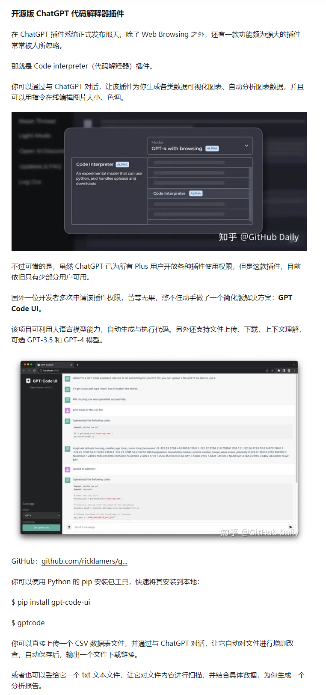

# 18. [`GPTCache`: 用`向量数据库`做缓存](https://github.com/zilliztech/GPTCache)

`GPTCache`使用向量数据库技术为各种 LLM 应用提供一层语义缓存，能够存储 LLM 响应，从而显著减少检索数据所需的时间、降低 API 调用开销、提升应用可扩展性。

# 17. [开源项目 PDF-GPT](https://github.com/bhaskatripathi/pdfGPT)

# 16. [Bloop: 基于GPT构建的代码搜索引擎](https://zhuanlan.zhihu.com/p/624362567)

用 `rust` 实现，采用基于GPT-4的AI智能模型，成功实现用自然语言，语义化的代码搜索方式。

你可以通过 `Bloop`，直接使用自然语言、正则表达式，来快速过滤查询搜索本地和远程存储库。让说读源码变得更为高效，可以腾出手专注于业务上的功能开发。

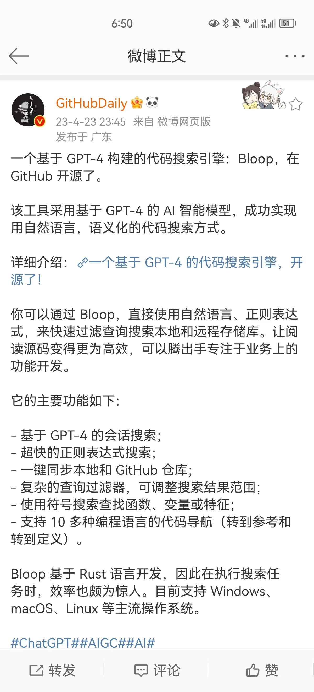

# 15. [Semantra](https://github.com/freedmand/semantra)

`Semantra` 是一个用于语义搜索文档的多用途工具。按含义查询，而不仅仅是通过匹配文本。

该工具在命令行上运行，可分析计算机上的指定文本和PDF文件，并启动本地Web搜索应用程序以进行交互式查询。

`Semantra`的目的是使运行专门的语义搜索引擎变得简单，友好，可配置和私密/安全。

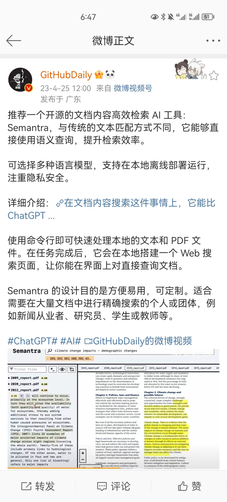

# 14. [Quivr: 开源 AI知识库解决方案](github.com/StanGirard/quivr)

`Quivr`: 支持: 文本，图像，视频，代码片段，PPT，Excel 数据据表 上传云端

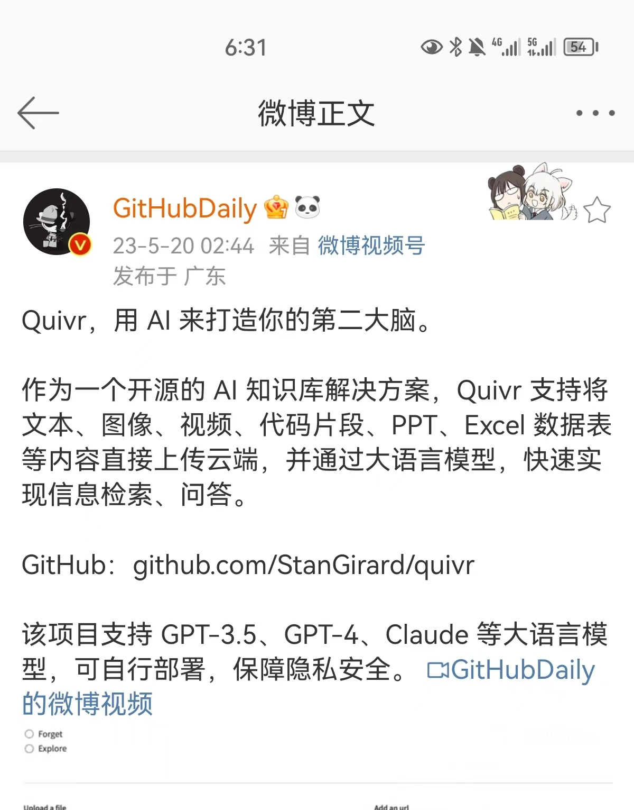

# 13. 五月中旬：OpenAI 上架 iOS APP

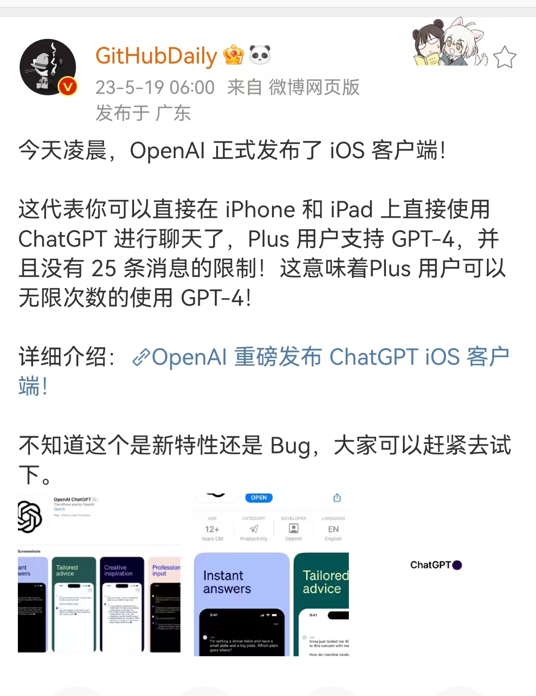

# 12. [NVIDIA正在制造自己的CPU](https://weibo.com/1727858283/4907300449682143)

# 11. [知乎：想成为一名提示工程师都需要学习什么？](https://www.zhihu.com/question/593938418/answer/3056641740)

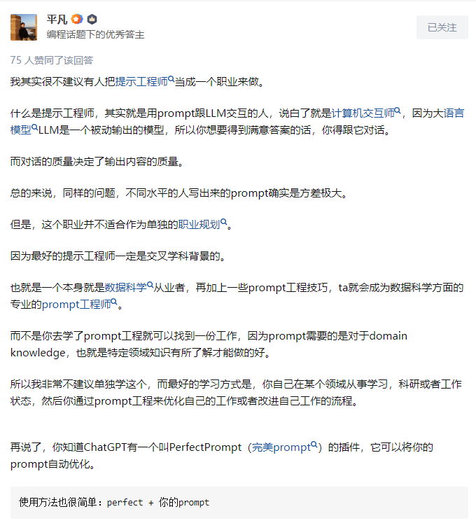

# 10. [OpenAI 两年规划](https://foresightnews.pro/article/detail/34376)

目前问题焦点: 缺乏 GPU

+ 2023年
    - 更便宜、更快的 GPT-4
    - 更多 token
    - 微调 api
    - 有状态的 API
+ 2024年
    - 多模态

# 09. [手机微调 LLM：原驼 `Guanaco`](https://zhuanlan.zhihu.com/p/632488033)

华盛顿大学 `QLoRA` 微调方法

+ 在评测基准上 可做到 ChatGPT 99%
+ 33B 只需要 24G-GPU 上微调
+ 65B 只需要 46G-GPU

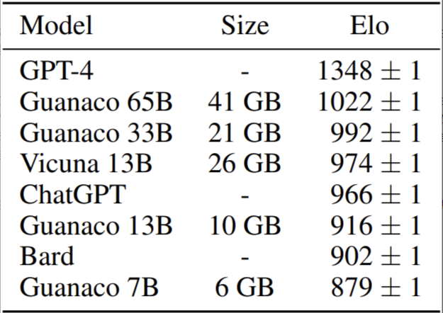

# 08. [思维树 ToT](https://zhuanlan.zhihu.com/p/633974673)

+ CoT 思维链
+ ToT 思维树

# 07. [英伟达 VOYAGER: LLM驱动，可以终身学习的游戏智能体](https://zhuanlan.zhihu.com/p/632739144)

# 06. [OpenAI联合创始人亲自上场科普GPT，让技术小白也能理解最强AI](https://zhuanlan.zhihu.com/p/633176312)

# 05. [“使用ChatGPT API构建系统” 对 Prompt 的个人解读](https://www.zhihu.com/question/593938418)

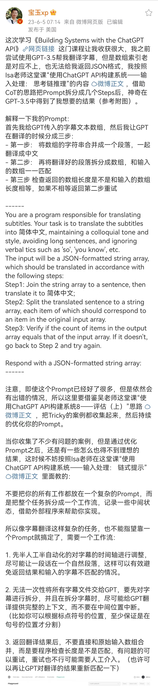

# 04. [MathTranslate：翻译 Latex 成 中文 PDF](https://weibo.com/1727858283/N2PX5uluz)

也可以我的 [笔记](https://zhuanlan.zhihu.com/p/633316249)

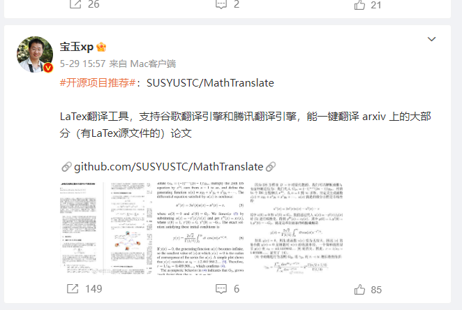s

# 03. [通过人话查HuggingFace模型](https://weibo.com/5722964389/N2XXqnYhj)

通过自然语言，快速检索 HuggingFace 上面各种模型。

通过这种方式，我们可以挖掘到各类「图像生成」、「文档智能对话」、「AI 视频合成」等实用的 AI 模型。

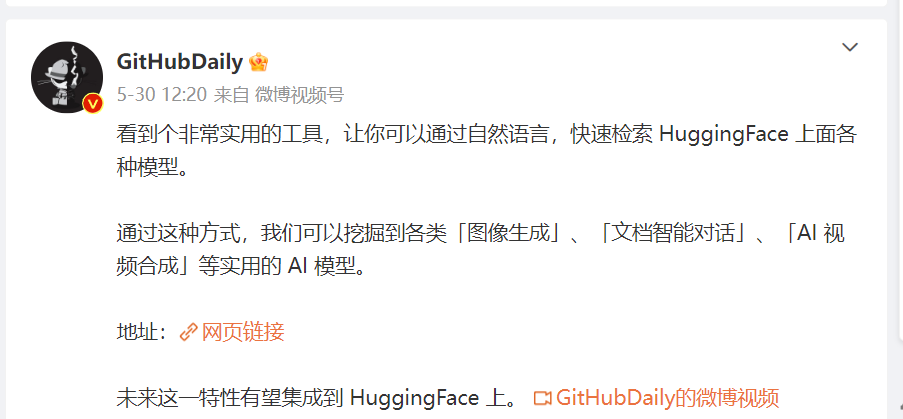

# 02. [产品：Build & Sell]()

# 01. [Azure GPT-3.5 的性能](https://weibo.com/1402400261/N3sQOw7eE)

按照Cursor的作者Aman Sanger的测试，如果你使用Completion的模式（需要借助Azure）而不是Chat的模式调用gpt-3.5-turbo API，性能要好很多。

Gpt-3.5-turbo 在编程方面被严重低估：使用 Azure 的 completion 模式而不是 OpenAI 的 chat 模式时，HumanEval 的性能可以从 < 50% 跃升到 74% ！

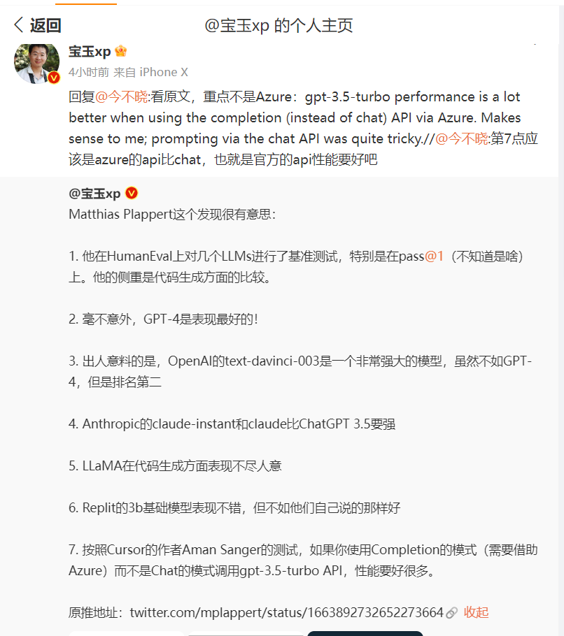

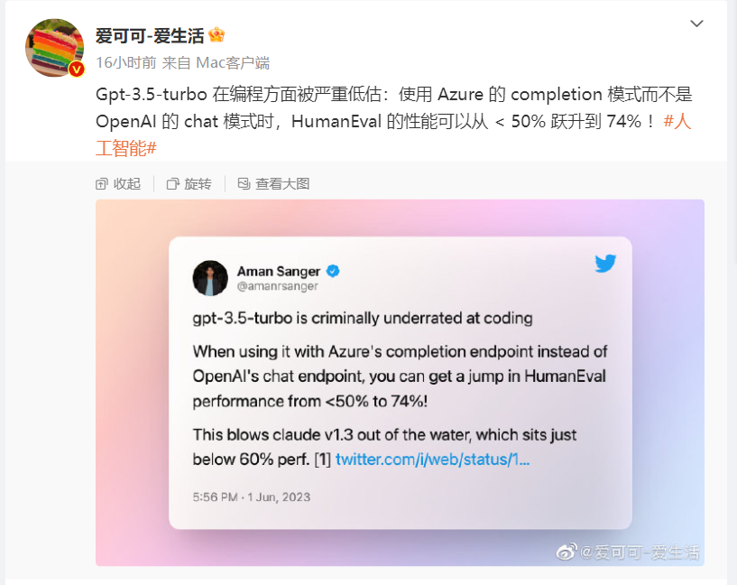