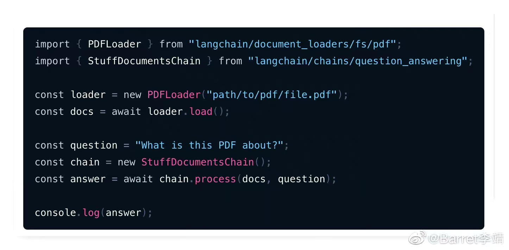

- [08. 向量数据库](#08-向量数据库)
- [07. PDF QA](#07-pdf-qa)
- [06. Mendable AI: 代码网站 QA 系统](#06-mendable-ai-代码网站-qa-系统)
- [05. 论文: UI-任务处理](#05-论文-ui-任务处理)
- [04. Langchain使用: 逆向Twitter更好地理解代码](#04-langchain使用-逆向twitter更好地理解代码)
- [03. FastChat: 基于LangChain和Vicuna-13B的QA](#03-fastchat-基于langchain和vicuna-13b的qa)
- [02. WhisperX: 音频识别 \& 翻译](#02-whisperx-音频识别--翻译)
- [01. AI agent: ChatGPT插件](#01-ai-agent-chatgpt插件)

# 08. 向量数据库

+ [高维数据检索：基于近邻图的近似最近邻搜索算法](https://zhuanlan.zhihu.com/p/415320221)
    - 算法 NSW HNSW FANNG NGT SPTAG  KGraph EFANNA IEH NSG NSSG Vamana HCNNG
+ [向量检索引擎](https://zhuanlan.zhihu.com/p/364923722)
    - `Faiss` 、`milvus`、`Proxima`、`vearch`、`Jina`

# 07. PDF QA

现在写长pdf内容问答，只要7行Python代码。但还做不到根据问题自动跳转到给定链接去阅读另一篇pdf然后回答，要做到这一点需要agent的支持。

论文很多都是认为你有相关背景，遇到相关的基础概念或relate work会简单提一句，然后附上链接，如果对基础没啥概念的时候，就需要让ai 自动 去另一篇论文递归搞一遍然后联合给出答案。

# 06. [Mendable AI: 代码网站 QA 系统](https://www.mendable.ai/)

刚发现一个工具，输入github网址，然后问问题，要他帮你写代码都可以。

好处：学习一个新的代码库，可以从那里出发，不停的问问题，比gpt会有针对性一点。比你从头看文档会快一点，特别是对相关概念陌生时

特点：答案后面带上了相关文档 代码的链接

# 05. [论文: UI-任务处理](https://arxiv.org/abs/2306.00245)

通过基于像素的预训练和树搜索方法，成功创建了能用屏幕截图和通用动作空间与数字世界进行交互的智能体程序，并在GUI指令遵循任务中取得了优秀的性能。

《From Pixels to UI Actions: Learning to Follow Instructions via Graphical User Interfaces》

# 04. [Langchain使用: 逆向Twitter更好地理解代码](https://dev.to/mikeyoung44/a-plain-english-guide-to-reverse-engineering-the-twitter-algorithm-with-langchain-activeloop-and-deepinfra-47fh)

推荐一篇关于 LangChain 的保姆级教程，网页链接，以逆向 Twitter 推荐算法的代码库为例，借助 LangChain 让你像一个经验丰富的老手一般，做到能够快速理解、使用甚至修改代码。

过程中将 LangChain 中的几个关键模块，解释的十分清楚，包括向量数据库储存数据，示例中使用的是 Activeloop 云数据库，讲解如何使用 VectorStores 模块；使用 DeepInfra 提供的 Dolly-v2-12b 来讲解如何使用 LLM 模块；还详细讲解了，如何使用 Conversational RetrieverChain 来实现向量数据库的最佳数据匹配、上下文对话处理等。是一篇很不错的入门教程。

# 03. [FastChat: 基于LangChain和Vicuna-13B的QA](https://lmsys.org/blog/2023-06-09-api-server/?continueFlag=d985a3e8b154443756e90085ded168e1)

通过`FastChat`实现兼容OpenAI的本地API服务，用`LangChain`和`Vicuna-13B`模型进行问答和代码理解等任务

《Building a Truly "Open" OpenAI API Server with Open Models Locally | LMSYS Org》

# 02. [WhisperX: 音频识别 & 翻译](https://github.com/m-bain/whisperX)

web版本见 [这里](https://huggingface.co/spaces/Xenova/whisper-web)

这个程序的特点是可以按照单词对齐时间戳，所以基本上生成的字幕都是完整的句子。生成结果除了srt还有json文件，里面有每一行里面单词的时间戳，可以根据需要二次整理字幕。另外它还能识别发言人，准确率还可以。需要NVIDIA的显卡，好在Google Colab可以运行（需要启用GPU）。

好处是，如果你不想从头看几个小时的课程，可以先弄字幕翻译，然后 先看字幕，有不懂的再回头看对应的画面。这样能节省时间，否则几个小时的视频，很多多是你懂的东西，听也难不听也可惜。

[这里](https://github.com/JimLiu/whisper-subtitles/blob/main/whisperx_youtube_subtitle.ipynb)是个demo，根据YouTube Url识别YouTube字幕的Jupyter Notebook

# 01. [AI agent: ChatGPT插件](https://weibo.com/1727858283/N4EPDxJHt) 

类似于AutoGPT的插件版，能外接存储，能配合其他插件使用

