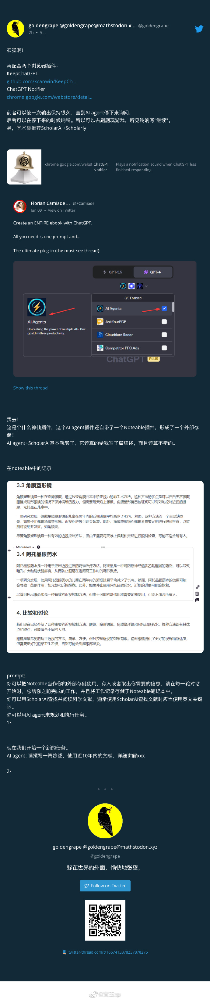

- [05. 论文: UI-任务处理](#05-论文-ui-任务处理)
- [04. 逆向Twitter更好地理解代码](#04-逆向twitter更好地理解代码)
- [03. FastChat: 基于LangChain和Vicuna-13B的QA](#03-fastchat-基于langchain和vicuna-13b的qa)
- [02. WhisperX: 音频识别 \& 翻译](#02-whisperx-音频识别--翻译)
- [01. AI agent: ChatGPT插件](#01-ai-agent-chatgpt插件)

# 05. [论文: UI-任务处理](https://arxiv.org/abs/2306.00245)

通过基于像素的预训练和树搜索方法，成功创建了能用屏幕截图和通用动作空间与数字世界进行交互的智能体程序，并在GUI指令遵循任务中取得了优秀的性能。

《From Pixels to UI Actions: Learning to Follow Instructions via Graphical User Interfaces》

# 04. [逆向Twitter更好地理解代码](https://weibo.com/1402400261/N4CqIg8eN)

LangChain实战教程：通过逆向工程Twitter推荐算法来更好地理解代码，并提供洞察以制作更好的内容。使用OpenAI的嵌入和名为`Activeloop`的工具使代码可理解，并使用托管在DeepInfra上的LLM(语言模型)与代码进行对话

《A Plain English Guide to Reverse-Engineering the Twitter Algorithm with LangChain, Activeloop, and DeepInfra - DEV Community》

# 03. [FastChat: 基于LangChain和Vicuna-13B的QA](https://lmsys.org/blog/2023-06-09-api-server/?continueFlag=d985a3e8b154443756e90085ded168e1)

通过`FastChat`实现兼容OpenAI的本地API服务，用`LangChain`和`Vicuna-13B`模型进行问答和代码理解等任务

《Building a Truly "Open" OpenAI API Server with Open Models Locally | LMSYS Org》

# 02. [WhisperX: 音频识别 & 翻译](https://github.com/m-bain/whisperX)

web版本见 [这里](https://huggingface.co/spaces/Xenova/whisper-web)

这个程序的特点是可以按照单词对齐时间戳，所以基本上生成的字幕都是完整的句子。生成结果除了srt还有json文件，里面有每一行里面单词的时间戳，可以根据需要二次整理字幕。另外它还能识别发言人，准确率还可以。需要NVIDIA的显卡，好在Google Colab可以运行（需要启用GPU）。

好处是，如果你不想从头看几个小时的课程，可以先弄字幕翻译，然后 先看字幕，有不懂的再回头看对应的画面。这样能节省时间，否则几个小时的视频，很多多是你懂的东西，听也难不听也可惜。

[这里](https://github.com/JimLiu/whisper-subtitles/blob/main/whisperx_youtube_subtitle.ipynb)是个demo，根据YouTube Url识别YouTube字幕的Jupyter Notebook

# 01. [AI agent: ChatGPT插件](https://weibo.com/1727858283/N4EPDxJHt) 

类似于AutoGPT的插件版，能外接存储，能配合其他插件使用

