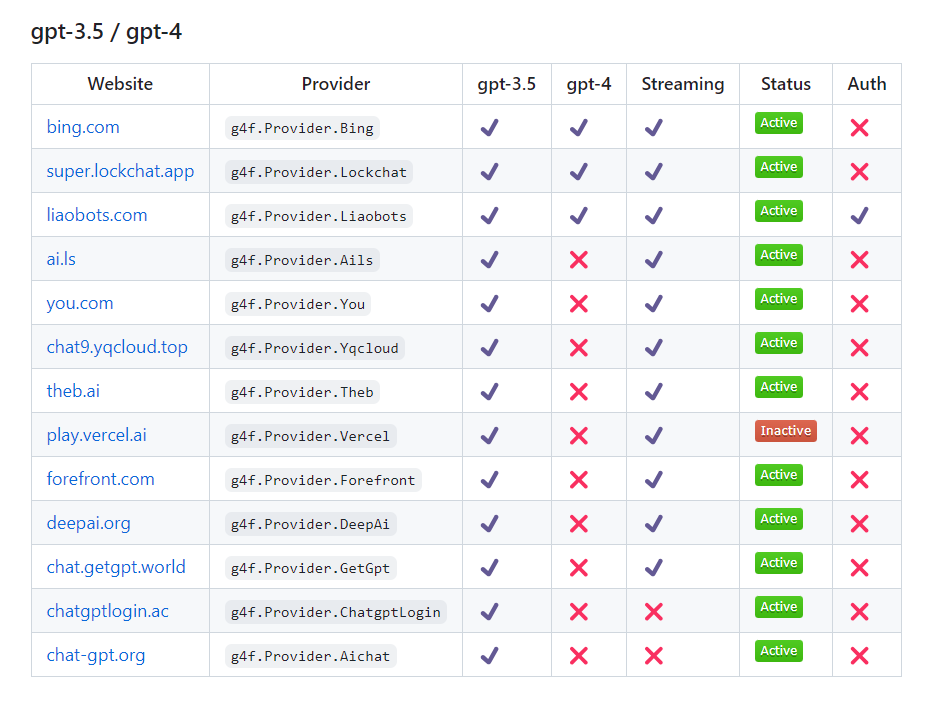
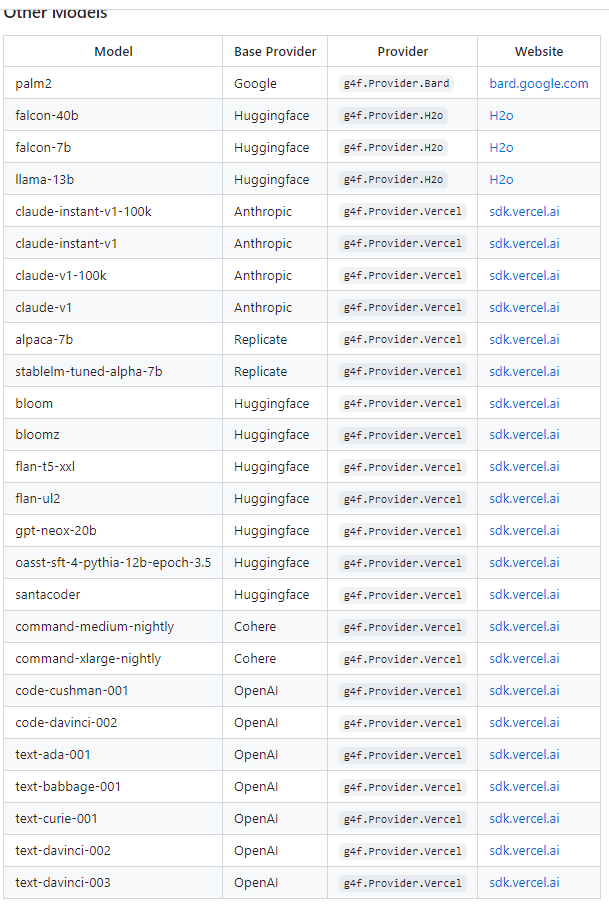

- [13. 如果《虚拟人生》游戏能接入现代先进的AI技术会怎么样？](#13-如果虚拟人生游戏能接入现代先进的ai技术会怎么样)
- [12. 电子书：构筑大语言模型应用：应用开发与架构设计](#12-电子书构筑大语言模型应用应用开发与架构设计)
- [11. Github Copilot 逆向分析](#11-github-copilot-逆向分析)
- [10. Chat Long Doc](#10-chat-long-doc)
- [09. Prompt 模式](#09-prompt-模式)
- [08. 北大 ChatLaw](#08-北大-chatlaw)
- [07. 微软 guidance](#07-微软-guidance)
- [06. ReliableGPT](#06-reliablegpt)
- [05. Diaphora：开源 程序diffing 分析 工具](#05-diaphora开源-程序diffing-分析-工具)
- [04. FreeGPT WebUI \& gpt4free](#04-freegpt-webui--gpt4free)
- [03. Danswer：开源企业级问答系统](#03-danswer开源企业级问答系统)
- [02. FastSAM 基于CNN，其性能与Facebook的`SAM`类似，但运行速度高50倍](#02-fastsam-基于cnn其性能与facebook的sam类似但运行速度高50倍)
- [01. SAM Exporter: 快速导出Segment Anything模型至不同格式](#01-sam-exporter-快速导出segment-anything模型至不同格式)

# 13. [如果《虚拟人生》游戏能接入现代先进的AI技术会怎么样？](https://weibo.com/1727858283/N7CZG9P0m)

这篇文章 第一部分是回顾了《虚拟人生》这类虚拟伴侣游戏的历史，第二部分重点探讨了将AI接入虚拟伴侣类游戏的可能。

# 12. [电子书：构筑大语言模型应用：应用开发与架构设计](https://aigc.phodal.com/?continueFlag=785b1b86603c0b46a030ec215edcaf12)

# 11. [Github Copilot 逆向分析](https://github.com/mengjian-github/copilot-analysis)

# 10. [Chat Long Doc](https://github.com/webpilot-ai/ChatLongDoc)

使您能够与任何长文档进行对话。它可以加快对内容的理解并有助于获得有价值的见解。与 ChatPDF 相比，它支持多种文件格式，包括 PDF、doc、docx、txt 和 web URL。

# 09. [Prompt 模式](https://prompt-patterns.phodal.com/?continueFlag=785b1b86603c0b46a030ec215edcaf12)

# 08. [北大 ChatLaw](https://github.com/PKU-YuanGroup/ChatLaw)

来自北京大学ChatExcel课题组开源的中文法律大模型ChatLaw，极大的解决了GPT的幻觉问题。

+ ChatLaw-13B：这是基于姜子牙Ziya-LLaMA-13B-v1（一个基于LLaMA 13B针对中文优化的微调的版本 网页链接）训练，这个版本中文支持很好，但是受模型参数大小的限制，逻辑能力相对较弱
+ ChatLaw-33B：这是基于Anima（一个开源的基于QLoRA的33B中文大语言模型github.com/lyogavin/Anima）训练的版本，逻辑推理能力比较强，但是由于Anima中文语料不足，问答时经常会出现中文数据
+ ChatLaw-Text2Vec：使用了93万条判决案例做成的向量数据集，基于BERT训练的相似度匹配模型，可以根据用户提问的内容检索到最相关的法律条文。

# 07. [微软 guidance](https://github.com/microsoft/guidance)

微软的 Guidance 对 prompt 的约束性做到了可编程的规范化，可轻松实现 JSON 格式输出、自定义格式输出等。

看起来就像是一个模板函数，变量部分可完全由 LLM 来补全，支持在模板中使用循环、函数、条件判断等编程逻辑来编排输出结果。 ​​​

# 06. [ReliableGPT](https://github.com/BerriAI/reliableGPT) 

解决 OpenAI 服务器：

+ API 错误
+ API 超时
+ 速率限制 错误
+ 服务 不可用 错误/过载
+ 上下文窗口 错误
+ 无效的 API 密钥错误

处理过程：

+ 失败重试策略（下面是可选策略）
    - 可指定 fallback_strategy=['gpt-3.5-turbo', 'gpt-4', 'gpt-3.5-turbo-16k', 'text-davinci-003']；遇到错误，则按给定顺序重试，直到收到有效响应。
+ 指定备份API-KEY：在多个服务器上使用 OpenAI 密钥
+ Context 溢出：会自动使用具有较大上下文窗口的模型重试您的请求

# 05. [Diaphora：开源 程序diffing 分析 工具](https://github.com/joxeankoret/diaphora)

源码 对比分析 工具

支持 汇编、控制流图、符号名 和 注释移植 等

支持 并行分析、伪代码启发式算法 等

# 04. [FreeGPT WebUI & gpt4free](https://github.com/ramonvc/freegpt-webui)

FreeGPT WebUI 是 [gpt4free](https://github.com/xtekky/gpt4free) 的ui界面，主要作用 是 无需API-KEY 也 无需代理IP 就可以 访问 GPT3.5 / GPT4

+ 无需API-KEY: 为 [gpt4free](https://github.com/xtekky/gpt4free) 提供gui界面
+ 无需代理IP: 为有需要的用户搜集免费的 代理IP，默认30分钟 更新一次

**注：** [gpt4free](https://github.com/xtekky/gpt4free) 流程是：到给定网站访问非公开API，间接的访问 GPT3.5 / 4

# 03. [Danswer：开源企业级问答系统](https://github.com/danswer-ai/danswer)

`Danswer`：开源企业级问答系统，可以对内部文档进行自然语言提问，并返回可靠的答案、引用和参考资料

可以连接到多种常见工具，如Slack、GitHub 和 Confluence。

`Danswer`提供直接问答、智能文档检索和AI助手等功能，并支持用户认证和文档级的访问管理，还有一键部署和个性化搜索等特性

# 02. [FastSAM](https://github.com/CASIA-IVA-Lab/FastSAM) 基于CNN，其性能与Facebook的`SAM`类似，但运行速度高50倍

# 01. [SAM Exporter: 快速导出Segment Anything模型至不同格式](https://github.com/vietanhdev/samexporter)

SAM Exporter：快速导出Segment Anything模型至不同格式，方便使用，可用于快速推理