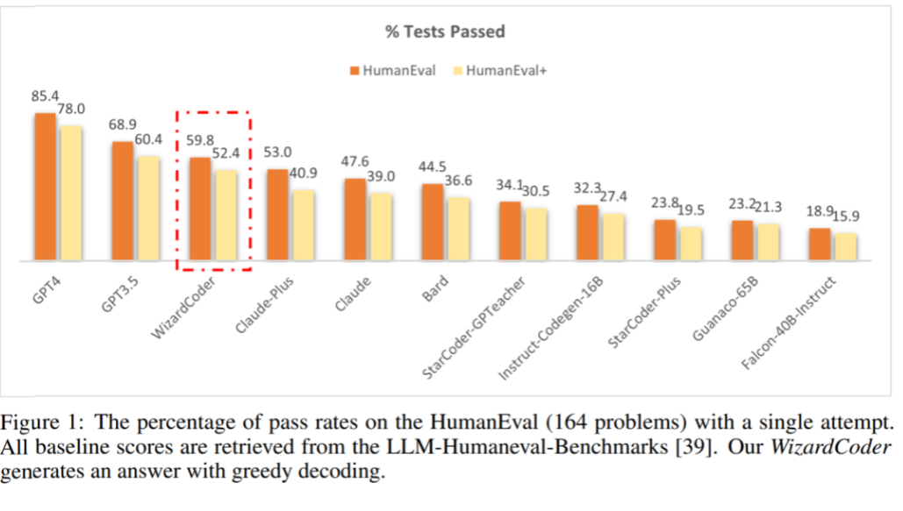

- [18. 阮一峰: 如何免费使用 ChatGPT](#18-阮一峰-如何免费使用-chatgpt)
- [17. GPT-4 参数](#17-gpt-4-参数)
- [16. OpenAI API 温度](#16-openai-api-温度)
- [15. gpt-author 使用GPT-4和Stable Diffusion API调用链生成原创奇幻小说](#15-gpt-author-使用gpt-4和stable-diffusion-api调用链生成原创奇幻小说)
- [14. Azure OpenAI API](#14-azure-openai-api)
- [13. ChatDB: 利用 Langhain 和 Sql 整合 LLM](#13-chatdb-利用-langhain-和-sql-整合-llm)
- [12. 如何利用`OpenAI Function Calling` 解析递归机构](#12-如何利用openai-function-calling-解析递归机构)
- [11. replicate 提供 Stable Diffuse API](#11-replicate-提供-stable-diffuse-api)
- [10. Data-Driven Characters：用LangChain从现有语料生成特定角色聊天机器人](#10-data-driven-characters用langchain从现有语料生成特定角色聊天机器人)
- [09. FableForge：用单条提示生成整本图画书](#09-fableforge用单条提示生成整本图画书)
- [08. MultiPDF Chat App](#08-multipdf-chat-app)
- [07. 结合符号性记忆，清华等提出ChatDB，提升大模型的复杂推理能力](#07-结合符号性记忆清华等提出chatdb提升大模型的复杂推理能力)
- [06. WizardCoder: 编程任务仅次于GPT](#06-wizardcoder-编程任务仅次于gpt)
- [05. 斯坦福发布的LLM排行榜](#05-斯坦福发布的llm排行榜)
- [04. 开源软件 开发/管理 的 技能模型](#04-开源软件-开发管理-的-技能模型)
- [03. 普林斯顿：`Infinigen` 程序生成虚拟场景](#03-普林斯顿infinigen-程序生成虚拟场景)
- [02. Google发布 AI试衣模型 TryOnDiffusion](#02-google发布-ai试衣模型-tryondiffusion)
- [01. Vercel AI SDK: 前端版的`LangChain`](#01-vercel-ai-sdk-前端版的langchain)

# 18. [阮一峰: 如何免费使用 ChatGPT](http://www.ruanyifeng.com/blog/2023/06/weekly-issue-259.html)

+ [Github 网址 1](https://github.com/LiLittleCat/awesome-free-chatgpt)
+ [Github 网址 2](https://github.com/lzwme/chatgpt-sites)
+ [Github 网址 3](https://github.com/xxxily/hello-ai/blob/main/home/FreeChatGPTSiteList.md)

# 17. [GPT-4 参数](https://twitter.com/fi56622380)

GPT2有15亿参数，GPT3有1750亿参数，GPT-4有多少参数一直是个迷，今天终于有线索了

Meta的 PyTorch founding engineer 暗示，从不止一个来源的消息来看，GPT-4是8个一模一样的220B模型连起来做的，只是训练数据不同，8个专家模型mixture expert model，一共1.76T参数，每次推理要做16次循环推理

这个消息我认为比较合理，有一定可信度，解释了长久以来我的一些疑惑：

为什么openAIGPT1/2/3都第一时间公布参数，但在GPT4阶段对参数守口如瓶？

为什么openAI一直宣称暂时没有训练GPT5的计划？

当时看的第一眼就觉得很奇怪（图二），为什么GPT4和GPT3.5的base model的factuality差距那么小？

真没想到，最先开始组合路线ensemble method的是大力出奇迹路线闻名于世的openAI

------------------------------------------

这也算是之前对Hype Cycle的想法的一个论据：

要了解一个技术到什么阶段，可以看表现方式是大力出奇迹还是组合出奇迹

当一个技术还在最早期发展阶段时，基本上就是按着scale up的路径。只有当scale up获得的边际收益太小的时候，才会开始找组合的路径

比如说在机器学习里，最开始都是单个的model，当单个model的潜力挖掘的差不多到瓶颈之后，就开始了ensemble method，这时候就是stacking发挥作用的地方，也就是用一群model做推理，通过处理投票结果方式或者锦标赛模式组合来达到更好的效果，这就是典型的组合模式

再比如早期的CPU基本是按着频率和工艺制程scale up，到后来就是多核或者大小核的组合，和专用处理器GPU的组合，到SoC就是更大的组合，来满足算力的新需求(最新的苹果MR Vision pro为了达到低延迟，甚至开启了新的R1专门处理传感器融合问题，这也是组合)

当然了这个大力阶段和组合阶段不会是单向的，"ML在应用领域的趋势一直都是从multiple components on one stack到end to end solution 这也算是从组合到规模的变化方向"

所以更可能是一种循环：

规模scale up->组合->更大尺度上的规模变大->更大尺度的组合循环

# 16. [OpenAI API 温度](https://weibo.com/6444741184/N6kmpbW8k)

我们在调用LLM的API时，有时候需要调整温度(temperature)参数，这个参数有什么用呢？

在Google的“生成式AI学习”课程的“Encoder-Decoder Architecture: Overview 编码器-解码器架构”这期视频里面，里面谈到了temperature参数的作用。

如果温度很高，它会使得所有Token的得分变得接近于0，这意味着这个Token更有可能被选中。会有更多的多样性，更多的内容可以被预测，这会使得模型变得更有创造性。但如果温度太高，神经网络只会预测出无意义的东西。

如果温度非常低，最高的概率得分会被乘以一个非常大的数，这会使得最高得分的Token有更大的被选中的概率，也就是说，模型的行为会更加确定。

# 15. [gpt-author 使用GPT-4和Stable Diffusion API调用链生成原创奇幻小说](https://github.com/mshumer/gpt-author)

用户提供初始提示和章节数，AI会生成整本小说，输出与电子书阅读器兼容的EPUB文件，一本15章的小说只需$4，几分钟写成

# 14. [Azure OpenAI API](https://51.ruyo.net/18402.html)

需要：企业邮箱，企业官网；

+ （截至 2023.06）可能是国内唯一没有风控的`OpenAI API`付费渠道
+ 企业邮箱：最快的是使用 腾讯 的 企业邮箱； 如果考虑到使用 海外接口 的 安全问题，可以使用 `aws`
+ [点这里](https://docs.aws.amazon.com/zh_cn/workmail/latest/adminguide/howto-start.html)：申请 `aws`账号；在`aws`买域名；按流程注册邮箱

可以直接使用`OpenAI`的模型（如`ChatGPT`和`GPT-4`）来处理你的数据。

`Azure OpenAI` 服务可以连接到任何数据源，无论数据存储在本地还是云端。此外，`Azure OpenAI`服务支持从多个数据源获取数据。

+ `Azure`认知搜索索引：您可以将数据连接到Azure认知搜索索引，从而实现与OpenAI模型的无缝集成。
+ `Azure Blob` 存储容器
+ 包括 `txt`, `md`, `html`, `word`, `ppt`, `pdf` 等

`Azure OpenAI`服务提供了一个聊天沙盒环境，这是一个无代码环境，

用户可以在其中实验、迭代，并根据自己的提示生成完成的代码。

用户还可以选择直接从`Azure AI`工作室部署一个`Web`应用，创建一个可供组织访问的对话AI平台。

# 13. [ChatDB: 利用 Langhain 和 Sql 整合 LLM](https://www.jiqizhixin.com/articles/2023-06-20-8)

说白了，类似 Langchain 的一种Agent 的 使用模式；数据库表要根据场景自己设计；

+ 论文地址：https://arxiv.org/abs/2306.03901
+ 项目主页：https://chatdatabase.github.io
+ 项目代码：https://github.com/huchenxucs/ChatDB

近期，清华大学和北京智源人工智能研究院的研究者们提出了一种新型的符号性（symbolic）记忆模块。他们从现代计算机架构中汲取灵感，利用符号性记忆模块来增强大型语言模型。这种符号性记忆模块可以利用符号性的操作，精确的控制记忆模块中的信息。这样的符号性记忆框架由一个大语言模型（ 如 `ChatGPT` ）和一个数据库组成，称为 `ChatDB`。

其中大语言模型负责控制对记忆模块的读写操作。在 ChatDB 中，大语言模型通过生成 SQL 指令来操纵数据库，从而实现对记忆模块中历史信息精确的增删改查，并在需要时为大语言模型提供信息，以帮助其回应用户的输入。这项研究可以让大语言模型胜任需要对历史信息进行长期且精确的记录、处理和分析的场景，例如各种管理和分析系统，以后甚至有望替代管理者，直接让大语言模型根据精确的历史数据做分析和决策。

# 12. [如何利用`OpenAI Function Calling` 解析递归机构](https://weibo.com/1727858283/4914861421363777)

`OpenAI`的`Function Calling`的 parameters 说明是基于`JSON schema`规范的

`JSON Schema`里面有一个特殊的关键字叫`$ref`

``` JSON

"children": {
  "type": "array",
  "description": "The tree nodes",
  "items": { "$ref": "#" }
}
```

# 11. [replicate 提供 Stable Diffuse API](https://replicate.com/)

[对比 Stability.ai 的 API 的 差异](https://www.similarweb.com/website/replicate.com/vs/stability.ai/#traffic)

注：不同的模型需要在不同的硬件运行，要查看demo和文档

三选一，具体看模型

+ `CPU`: $0.0002/秒；0.012/分
+ `NV T4`: $0.00055/秒; $0.033/分
+ `A100` 40GB: $0.0023/秒; $0.138/分

例子: 下面模型要在 `A100` 跑，9秒内算完，[mj-v4 类似 模型](https://replicate.com/tstramer/midjourney-diffusion)

# 10. [Data-Driven Characters：用LangChain从现有语料生成特定角色聊天机器人](https://github.com/mbchang/data-driven-characters)

Data-Driven Characters：用LangChain从现有语料生成特定角色聊天机器人

# 09. [FableForge：用单条提示生成整本图画书](https://github.com/e-johnstonn/FableForge)

`FableForge`：用单条提示生成整本图画书，基于`OpenAI`的function calling 和 `Replicate` 的 Stable Diffusion API

# 08. [MultiPDF Chat App](https://github.com/alejandro-ao/ask-multiple-pdfs)

MultiPDF Chat App：与多个PDF文档进行聊天，用自然语言提问，根据文档内容提供相关回答

# 07. [结合符号性记忆，清华等提出ChatDB，提升大模型的复杂推理能力](https://www.jiqizhixin.com/articles/2023-06-20-8)

+ 论文 https://arxiv.org/abs/2306.03901
+ 代码 https://github.com/huchenxucs/ChatDB

近期，清华大学和北京智源人工智能研究院的研究者们提出了一种新型的符号性（symbolic）记忆模块。他们从现代计算机架构中汲取灵感，利用符号性记忆模块来增强大型语言模型。这种符号性记忆模块可以利用符号性的操作，精确的控制记忆模块中的信息。这样的符号性记忆框架由一个大语言模型（如 ChatGPT）和一个数据库组成，称为 ChatDB。其中大语言模型负责控制对记忆模块的读写操作。在 ChatDB 中，大语言模型通过生成 SQL 指令来操纵数据库，从而实现对记忆模块中历史信息精确的增删改查，并在需要时为大语言模型提供信息，以帮助其回应用户的输入。这项研究可以让大语言模型胜任需要对历史信息进行长期且精确的记录、处理和分析的场景，例如各种管理和分析系统，以后甚至有望替代管理者，直接让大语言模型根据精确的历史数据做分析和决策。

# 06. [WizardCoder: 编程任务仅次于GPT](https://www.jiqizhixin.com/articles/2023-06-20-5)



# 05. [斯坦福发布的LLM排行榜](https://tatsu-lab.github.io/alpaca_eval)

前十名：

|                      |        |
| -------------------- | ------ |
| GPT-4                | 95.28% |
| Claude               | 88.39% |
| ChatGPT              | 86.09% |
| WizardLM 13B         | 75.31% |
| Guanaco 65B          | 71.80% |
| Vicuna 13B           | 70.43% |
| LLaMA 33B OASST RLHF | 66.52% |
| Guanaco 33B          | 65.96% |
| Nous Hermes 13B      | 65.47% |
| Vicuna 7B            | 64.41% |

# 04. [开源软件 开发/管理 的 技能模型](https://arxiv.org/abs/2209.02222)

该模型包括 9个类别 的 45个技能：技术技能、工作风格、问题解决、贡献类型、项目特定技能、人际技能、外部关系、管理和特征。研究发现发现开源软件贡献者积极主动地提升技能，并认为与他人分享技能具有许多好处。同时该论文利用这一分析结果得出了一系列设计启示和最佳实践，供那些将技能纳入开源软件工具和平台（如GitHub）的人参考

# 03. [普林斯顿：`Infinigen` 程序生成虚拟场景](https://github.com/princeton-vl/infinigen)

普林斯顿刚开源了一个（开源免费的）元宇宙创世神器！`Infinigen`，用程序化的方式一键生成超逼真/多样化/UE5级别的虚拟场景！

感觉一下子解决了ACG场景生成 / 虚拟场景标注数据集生成两大问题，但是最大遗憾是目前所有场景几乎是随机生成的，如果将随机生成的代码和对应的场景之间加上人工对于这些场景的文字描述，构建一个“文字描述—虚拟实感场景模型—程序化代码+参数”的训练集，然后train一个 text 2 scene的AI，以后直接文字描述生成完备的三维拟真场景，这个未来简直不敢想象！

+ 程序化：Infinigen 不是有限的 3D 资产或合成图像集合，而是一个可以生成无限多不同形状、纹理、材质和场景组合的生成器。所以理论上可以生成无限多无限丰富的场景。
+ 完备性：Infinigen 提供了涵盖自然世界中各种物体和场景的广泛内容，包括植物、动物、地形以及火、云、雨和雪等自然现象。
+ 真实几何mesh：与视频游戏资产中通常使用纹理贴图来伪造几何细节（如表面看起来崎岖但实际上是平坦）不同，Infinigen 中所有几何mesh细节都是真实的。
+ 可转换构建虚拟数据集：由于最终数据的完备性，生成的场景很容易转换为法线、深度、目标检测、实例分割等多种配对数据集。
+ 自由且开源：Infinigen 基于 Blender构建。Infinigen 的代码在 GPL 许可下免费发布。粗看论文，好像是先生成几何节点，再从几何节点转为python？

# [02. Google发布 AI试衣模型 TryOnDiffusion](https://tryondiffusion.github.io/)

Google发布 AI 试衣模型 TryOnDiffusion，一张全身照和衣服照片就可以生成穿上衣服的照片

# [01. Vercel AI SDK: 前端版的`LangChain`](https://github.com/vercel-labs/ai)

Vercel发布了Vercel AI SDK，简直就是前端版的`LangChain`，支持多种LLM，支持Stream，提供了一个名字为“ai”的npm包，你运行 npm install ai 就可以加到你的前端项目。

现已集成 OpenAI、Hugging Face、LangChain 等知名 AI 开发工具。未来 AI 应用的开发效率将越来越快，成本越来越低。

目前已支持 React/Next.js、Svelte/SvelteKit，下一步将支持 Nuxt/Vue。