- [27. DeepMind《自然》用`AlphaDev`发现了更快的排序算法](#27-deepmind自然用alphadev发现了更快的排序算法)
- [26. (观点) 任正非：末位淘汰的是领导，而非员工](#26-观点-任正非末位淘汰的是领导而非员工)
- [25. (观点) 技术栈：主流 \& 竞争力](#25-观点-技术栈主流--竞争力)
- [24. Huggingface Transformer 2.0](#24-huggingface-transformer-20)
- [23. Diffusers 0.17](#23-diffusers-017)
- [22. 通往AGI之路](#22-通往agi之路)
- [21. LTM-1 5000K Token](#21-ltm-1-5000k-token)
- [20. LLM应用构建全解析](#20-llm应用构建全解析)
- [19. GPT Code UI: 开源版 ChatGPT 代码解释器插件](#19-gpt-code-ui-开源版-chatgpt-代码解释器插件)
- [18. `GPTCache`: 用`向量数据库`做缓存](#18-gptcache-用向量数据库做缓存)
- [17. 开源项目 PDF-GPT](#17-开源项目-pdf-gpt)
- [16. Bloop: 基于GPT构建的代码搜索引擎](#16-bloop-基于gpt构建的代码搜索引擎)
- [15. Semantra](#15-semantra)
- [14. Quivr: 开源 AI知识库解决方案](#14-quivr-开源-ai知识库解决方案)
- [13. 五月中旬：OpenAI 上架 iOS APP](#13-五月中旬openai-上架-ios-app)
- [12. NVIDIA正在制造自己的CPU](#12-nvidia正在制造自己的cpu)
- [11. 知乎：想成为一名提示工程师都需要学习什么？](#11-知乎想成为一名提示工程师都需要学习什么)
- [10. OpenAI 两年规划](#10-openai-两年规划)
- [09. 手机微调 LLM：原驼 `Guanaco`](#09-手机微调-llm原驼-guanaco)
- [08. 思维树 ToT](#08-思维树-tot)
- [07. 英伟达 VOYAGER: LLM驱动，可以终身学习的游戏智能体](#07-英伟达-voyager-llm驱动可以终身学习的游戏智能体)
- [06. OpenAI联合创始人亲自上场科普GPT，让技术小白也能理解最强AI](#06-openai联合创始人亲自上场科普gpt让技术小白也能理解最强ai)
- [05. “使用ChatGPT API构建系统” 对 Prompt 的个人解读](#05-使用chatgpt-api构建系统-对-prompt-的个人解读)
- [04. MathTranslate：翻译 Latex 成 中文 PDF](#04-mathtranslate翻译-latex-成-中文-pdf)
- [03. 通过人话查HuggingFace模型](#03-通过人话查huggingface模型)
- [02. 产品：Build \& Sell](#02-产品build--sell)
- [01. Azure GPT-3.5 的性能](#01-azure-gpt-35-的性能)

# 27. [DeepMind《自然》用`AlphaDev`发现了更快的排序算法](https://weibo.com/2194035935/N4kyOexoc) 

[知乎：平凡 的回答](https://www.zhihu.com/question/605448432/answer/3064901439)

优化的不是排序算法；是优化汇编指令的排列组合，找最优解；（用AI解决组合优化问题）

deepmind在nature上发布了一篇重磅文章《Faster sorting algorithms discovered using deep reinforcement learning》使用深度强化学习发现更快的排序算法 

之前deepmind用AlphaZero来玩围棋玩到独孤求败，现在他们用类似的思路开发了一个 AlphaDev。 AlphaDev从零开始发现了一些小的排序算法，这些算法的性能超过了以前已知的人类基准，特别是对于短序列，速度可以提高70%。这些算法已经集成到LLVM标准C++排序库中。 

之后AlphaDev被用来尝试发现更快的哈希算法。目前的结果是当将其应用于 9-16 字节范围的哈希函数时，AlphaDev 发现的算法速度提高了 30%。

不是直接优化C代码，而是去优化C生成的汇编代码，最后再逆向为C代码。所以理论上可能将来这些基础算法的代码也会变得人类不可理解了。

后续：[GPT-4 我也能上《自然》啊](https://www.qbitai.com/2023/06/60017.html)

DeepMind新AI登上Nature才一天，GPT-4就来打擂台了！

只通过两段提示，GPT-4就给出了和AlphaDev如出一辙的排序算法优化方法。

而AlphaDev被DeepMind称作是“重现AlphaGo神来之笔”，发现了提速70%的排序算法。

哦豁，这下AlphaDev更尴尬了。

让GPT-4“发现”同样操作的老哥直接阴阳：完全不需要强化学习啊。我能将这个发现登在Nature上吗？

马斯克“路过看到”，也留下了句“因吹斯听”。

# 26. [(观点) 任正非：末位淘汰的是领导，而非员工](https://weibo.com/2194035935/N4BVQDzHR)

任正非：“看到教师末位淘汰制，让我想起了以前华为也搞过末位淘汰，淘汰了一段时间后发现，被淘汰掉的全是员工，但剩下来的员工越来越没有积极性了，后来我改变了方法，不淘汰员工了，专门把末位干部淘汰掉，华为把末位淘汰方案这么一改变以后，整过公司的员工立即都变得有积极性了"。

任正非的这番言论引起了人们的广泛讨论，他用华为的末位淘汰政策的变化来说明了一个很重要的问题：仅仅淘汰员工是不足以提高公司的绩效的。他认为，真正能够提高公司业绩的是淘汰末位干部。这个观点不禁让人想起一个著名的笑话：如果要淘汰不负责任的员工，最好的方法就是升职加薪，让他们成为经理。

其实，这观点并不是空穴来风。在企业管理中，一些领导者会认为只有淘汰不称职的员工才能提高公司的业绩。但实际上，淘汰员工并不能解决根本问题。因为这些员工很可能是受到公司管理的影响，没有得到充分的培训和指导。此外，淘汰员工也可能会导致公司的人员流失和士气下降。

相反，任正非提出的淘汰末位干部的方法则更具有实际可行性。因为末位干部往往是对公司产生负面影响的人。他们可能是没有适应公司变化的能力，或者是没有正确领导团队的能力。因此，淘汰末位干部可以促进公司的整体进步。

# 25. [(观点) 技术栈：主流 & 竞争力](https://weibo.com/2194035935/N4CcwDBDt)

选择主流技术栈一定是最稳妥的选择么？ 

在很多非技术公司，快速招聘到一个程序员能继续维护系统可能高于其他因素，那么选择主流技术栈是个不错的选择。

但主流技术意味着缺少竞争力。在众多行业中，成本优势往往是极大的竞争力，而互联网It在以前因为属于高速增长的行业，增长会比成本更重要。但这个行业也要泯然众人矣，慢慢进入成本环节。

2009 年 March 收购 OKCupid，前者150台服务器，而后者只用了4台服务器就服务了10倍的客户。

再过些年，国内迟早要进入该模式，随着优秀程序员开始供给充足，企业竞争进入精细化阶段，通过少数程序员就能快速降低硬件以及管理成本会变的很重要。

所以，还是要好好学习技术

# 24. [Huggingface Transformer 2.0](github.com/xenova/transformers.js/)

Transformers 2.0 版本发布。

现在，你可以直接在 Web 浏览器上运行 HuggingFace Transformers，实现各种 AI 功能了。

仅需 3 行 JavaScript 代码，即可快速集成使用。

该项目现已支持执行以下 AI 任务：

📝 NLP：文本分类、摘要、翻译和文本生成 
🖼️ 视觉：图像分类、对象检测和分割 
🗣️ 音频：自动语音识别 
🐙 多模态：零示例图像分类

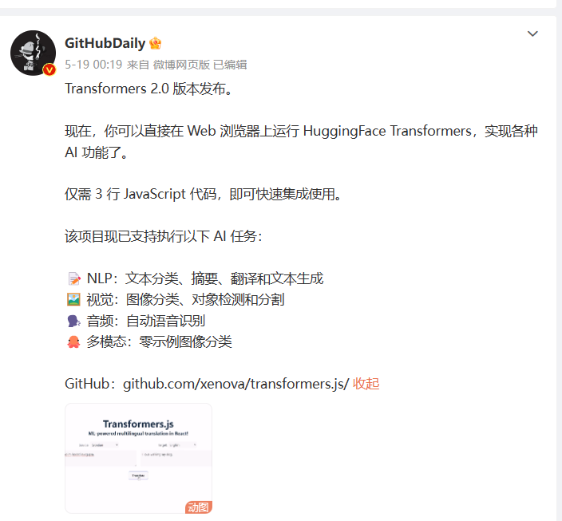

# 23. [Diffusers 0.17](github.com/huggingface/diffusers)

Diffusers v0.17.0 正式发布，改进了 LoRA、Kandinsky 2.1、Torch 编译加速等特性。

Diffusers 是一个预训练扩散模型的首选库，可用于生成图像、音频，甚至分子的 3D 结构。

GitHub：github.com/huggingface/diffusers

无论你是在寻找简单的推理解决方案还是训练自己的扩散模型，Diffusers 均可作为模块化工具箱提供支持。

该库设计重在可用性与可定制性，主要提供以下 3 个核心组件：

- 最先进的扩散管道，只需几行代码即可在推理中运行；
- 可互换的噪声调度器，用于不同的扩散速度和输出质量；
- 预训练模型可用作构建块，并与调度程序结合使用，用于创建自己的端到端扩散系统。

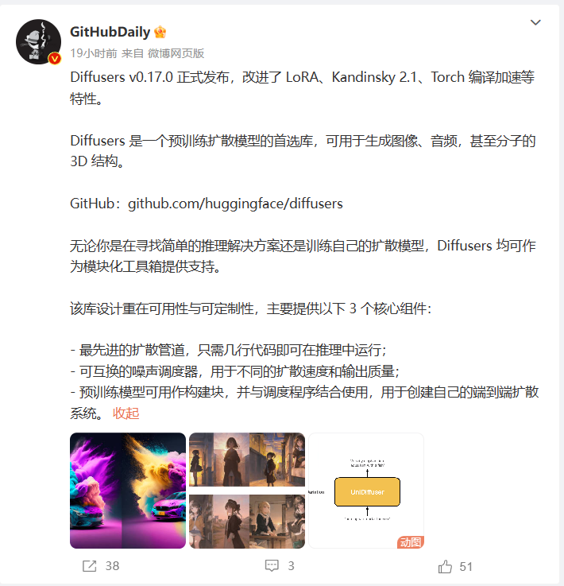

# 22. [通往AGI之路](https://waytoagi.com)

网站内容 包含了学习AI知识相关的各种图文和视频资料，包括Prompt、AI绘画、插件等众多内容

# 21. [LTM-1 5000K Token](https://weibo.com/1727858283/N4hBhEhgf)

LTM-1的LLM 支持最大500万Tokens，也就是5000K

比之前Claude的100K还多50倍，一本长篇小说都没问题了。

LTM-1 使用 LTM Net（Long-term Memory Network）的技术

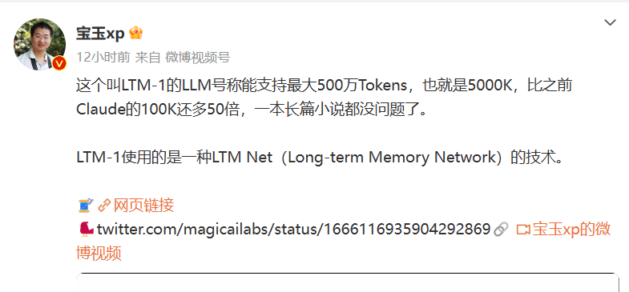

# 20. [LLM应用构建全解析](https://zhuanlan.zhihu.com/p/633288551)

重点：Langchain概念图示化

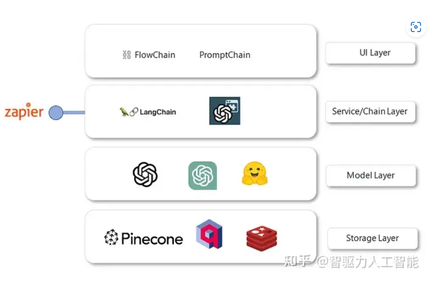

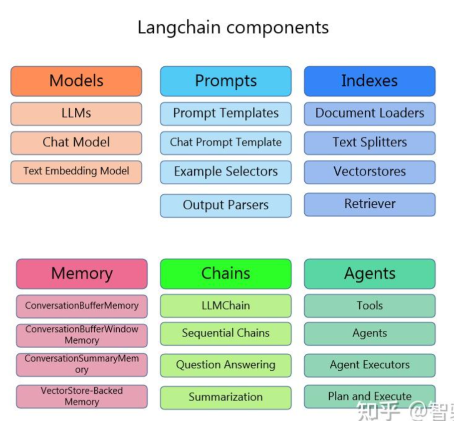

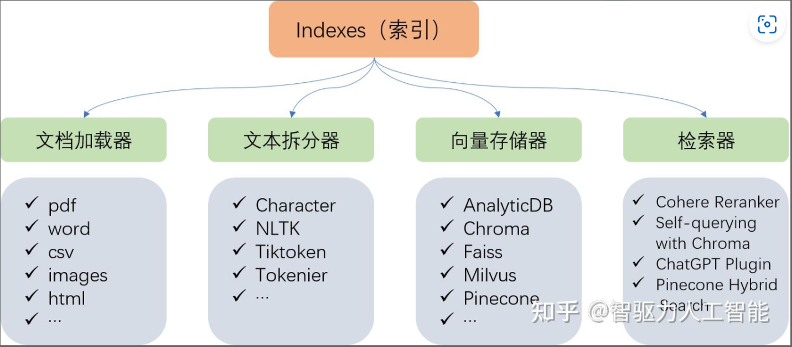

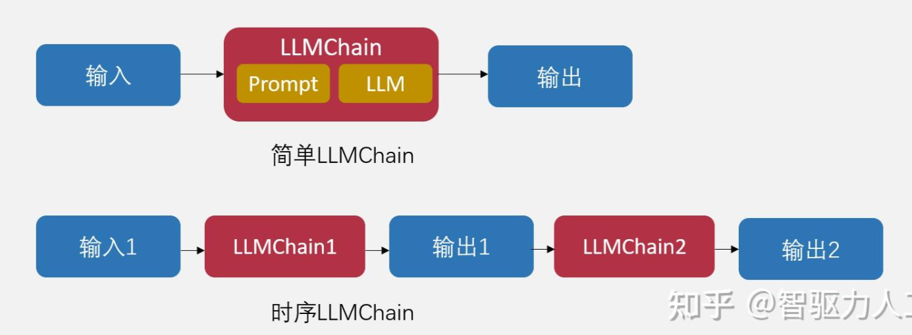

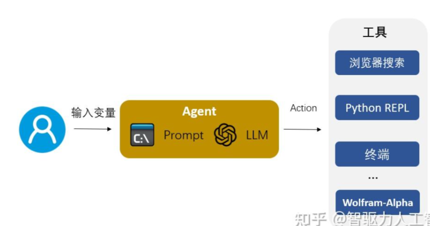

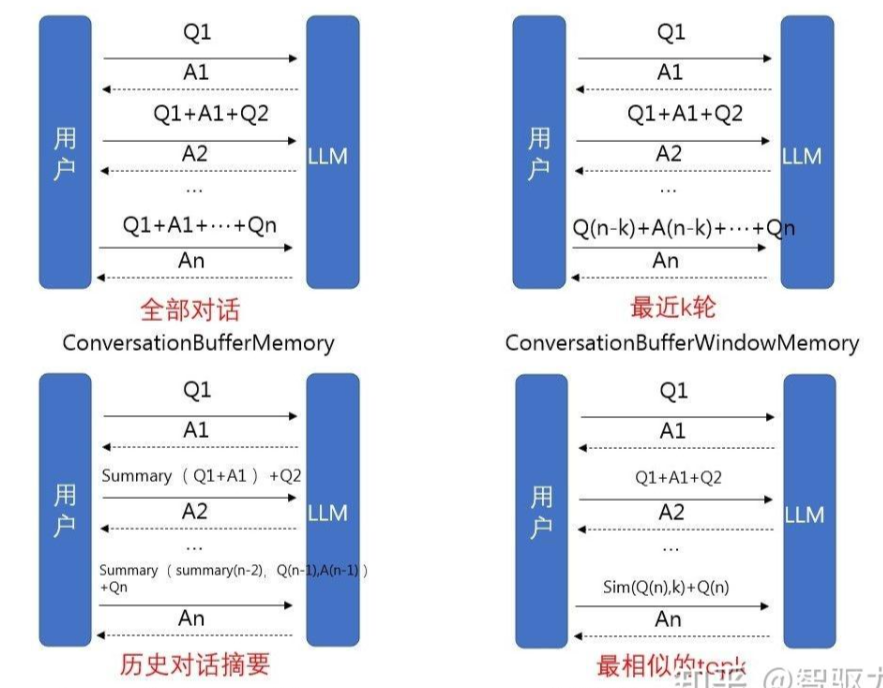

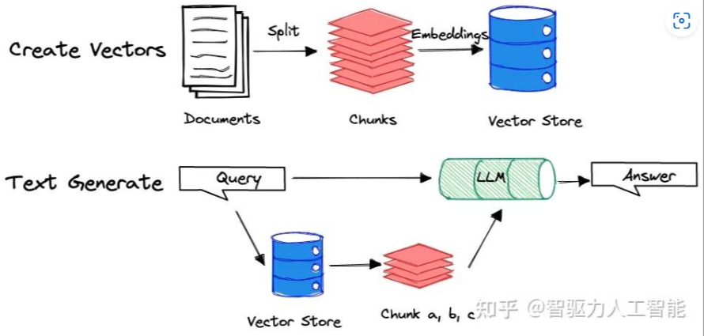

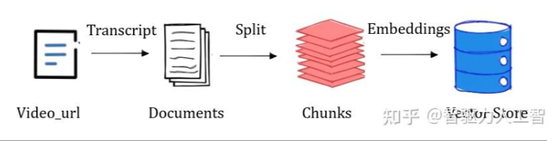

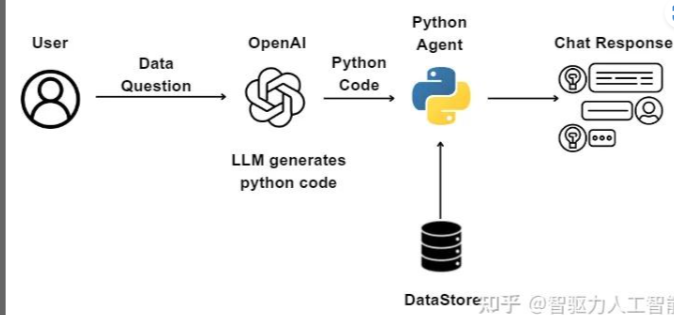

# 19. [GPT Code UI: 开源版 ChatGPT 代码解释器插件](https://github.com/ricklamers/gpt-code-ui/)

# 18. [`GPTCache`: 用`向量数据库`做缓存](https://github.com/zilliztech/GPTCache)

`GPTCache`使用向量数据库技术为各种 LLM 应用提供一层语义缓存，能够存储 LLM 响应，从而显著减少检索数据所需的时间、降低 API 调用开销、提升应用可扩展性。

# 17. [开源项目 PDF-GPT](https://github.com/bhaskatripathi/pdfGPT)

# 16. [Bloop: 基于GPT构建的代码搜索引擎](https://zhuanlan.zhihu.com/p/624362567)

用 `rust` 实现，采用基于GPT-4的AI智能模型，成功实现用自然语言，语义化的代码搜索方式。

你可以通过 `Bloop`，直接使用自然语言、正则表达式，来快速过滤查询搜索本地和远程存储库。让说读源码变得更为高效，可以腾出手专注于业务上的功能开发。

# 15. [Semantra](https://github.com/freedmand/semantra)

`Semantra` 是一个用于语义搜索文档的多用途工具。按含义查询，而不仅仅是通过匹配文本。

该工具在命令行上运行，可分析计算机上的指定文本和PDF文件，并启动本地Web搜索应用程序以进行交互式查询。

`Semantra`的目的是使运行专门的语义搜索引擎变得简单，友好，可配置和私密/安全。

# 14. [Quivr: 开源 AI知识库解决方案](github.com/StanGirard/quivr)

`Quivr`: 支持: 文本，图像，视频，代码片段，PPT，Excel 数据据表 上传云端

# 13. 五月中旬：OpenAI 上架 iOS APP

# 12. [NVIDIA正在制造自己的CPU](https://weibo.com/1727858283/4907300449682143)

# 11. [知乎：想成为一名提示工程师都需要学习什么？](https://www.zhihu.com/question/593938418/answer/3056641740)

# 10. [OpenAI 两年规划](https://foresightnews.pro/article/detail/34376)

目前问题焦点: 缺乏 GPU

+ 2023年
    - 更便宜、更快的 GPT-4
    - 更多 token
    - 微调 api
    - 有状态的 API
+ 2024年
    - 多模态

# 09. [手机微调 LLM：原驼 `Guanaco`](https://zhuanlan.zhihu.com/p/632488033)

华盛顿大学 `QLoRA` 微调方法

+ 在评测基准上 可做到 ChatGPT 99%
+ 33B 只需要 24G-GPU 上微调
+ 65B 只需要 46G-GPU

# 08. [思维树 ToT](https://zhuanlan.zhihu.com/p/633974673)

+ CoT 思维链
+ ToT 思维树

# 07. [英伟达 VOYAGER: LLM驱动，可以终身学习的游戏智能体](https://zhuanlan.zhihu.com/p/632739144)

# 06. [OpenAI联合创始人亲自上场科普GPT，让技术小白也能理解最强AI](https://zhuanlan.zhihu.com/p/633176312)

# 05. [“使用ChatGPT API构建系统” 对 Prompt 的个人解读](https://www.zhihu.com/question/593938418)

# 04. [MathTranslate：翻译 Latex 成 中文 PDF](https://weibo.com/1727858283/N2PX5uluz)

也可以我的 [笔记](https://zhuanlan.zhihu.com/p/633316249)

s

# 03. [通过人话查HuggingFace模型](https://weibo.com/5722964389/N2XXqnYhj)

通过自然语言，快速检索 HuggingFace 上面各种模型。

通过这种方式，我们可以挖掘到各类「图像生成」、「文档智能对话」、「AI 视频合成」等实用的 AI 模型。

# 02. [产品：Build & Sell]()

# 01. [Azure GPT-3.5 的性能](https://weibo.com/1402400261/N3sQOw7eE)

按照Cursor的作者Aman Sanger的测试，如果你使用Completion的模式（需要借助Azure）而不是Chat的模式调用gpt-3.5-turbo API，性能要好很多。

Gpt-3.5-turbo 在编程方面被严重低估：使用 Azure 的 completion 模式而不是 OpenAI 的 chat 模式时，HumanEval 的性能可以从 < 50% 跃升到 74% ！

