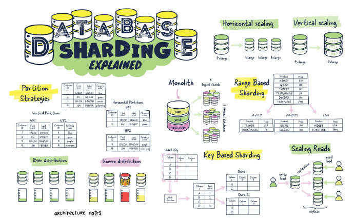
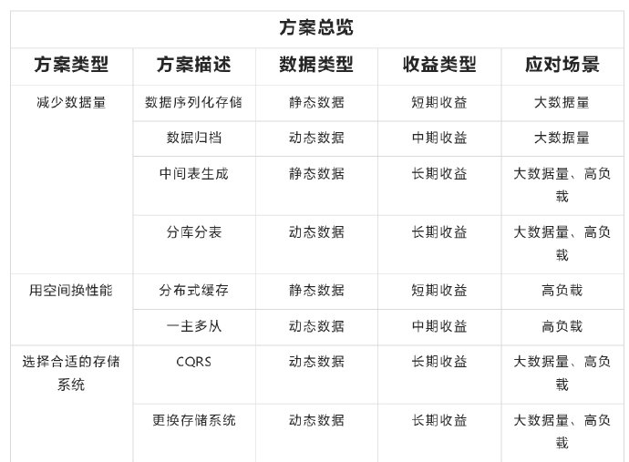
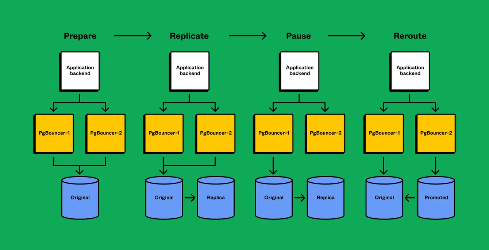

- [数据库技术](#数据库技术)
- [01. Database Sharding Explained](#01-database-sharding-explained)
- [02. 后端思维之数据库性能优化方案](#02-后端思维之数据库性能优化方案)
- [03. Figma: 数据库架构的成长之痛](#03-figma-数据库架构的成长之痛)

# 数据库技术

# 01. [Database Sharding Explained](https://architecturenotes.co/database-sharding-explained/)

这篇文章讨论了数据库分片技术，分片的好处，以及如何使用它以及何时不使用它。 

# 02. [后端思维之数据库性能优化方案](https://developer.aliyun.com/article/945903)

该篇文章主要从存储结构、存储系统中间两层的角度出发进行探讨，提出了8个优化方案。 ​​​

# 03. [Figma: 数据库架构的成长之痛](https://www.figma.com/blog/how-figma-scaled-to-multiple-databases)

文章介绍了Figma的数据库架构升级过程及遇到的各种问题/解决方案，以及未来的规划 ​​​

