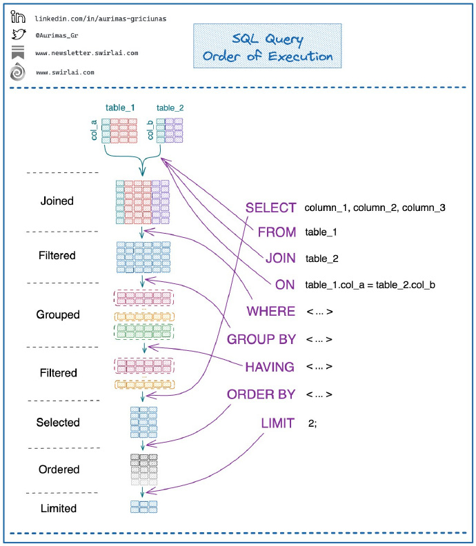

- [数据库技术](#数据库技术)
- [10. SQL查询语句执行顺序图 ​](#10-sql查询语句执行顺序图-)
- [09. Join的13种方式](#09-join的13种方式)
- [08. Exograph：以声明式方式创建灵活、安全高效的GraphQL查询和变更API的后端](#08-exograph以声明式方式创建灵活安全高效的graphql查询和变更api的后端)
- [07. GlareDB：用 SQL 查询和分析分布式数据的数据库系统](#07-glaredb用-sql-查询和分析分布式数据的数据库系统)
- [06. 知乎：推荐系统系列](#06-知乎推荐系统系列)
- [05. 为什么ClickHouse这么快](#05-为什么clickhouse这么快)
- [04. 关系数据库的解释](#04-关系数据库的解释)
- [03. Database Sharding Explained](#03-database-sharding-explained)
- [02. 后端思维之数据库性能优化方案](#02-后端思维之数据库性能优化方案)
- [01. Figma: 数据库架构的成长之痛](#01-figma-数据库架构的成长之痛)

# 数据库技术

# 10. SQL查询语句执行顺序图 ​

# 09. [Join的13种方式](https://justinjaffray.com/joins-13-ways)

# 08. [Exograph：以声明式方式创建灵活、安全高效的GraphQL查询和变更API的后端](https://github.com/exograph/exograph)

# 07. [GlareDB：用 SQL 查询和分析分布式数据的数据库系统](https://github.com/GlareDB/glaredb)

# 06. [知乎：推荐系统系列](https://www.zhihu.com/people/yan-yiceng/posts)

# 05. [为什么ClickHouse这么快](https://www.modb.pro/db/37700)

# 04. [关系数据库的解释](https://architecturenotes.co/things-you-should-know-about-databases)

# 03. [Database Sharding Explained](https://architecturenotes.co/database-sharding-explained/)

这篇文章讨论了数据库分片技术，分片的好处，以及如何使用它以及何时不使用它。 

# 02. [后端思维之数据库性能优化方案](https://developer.aliyun.com/article/945903)

该篇文章主要从存储结构、存储系统中间两层的角度出发进行探讨，提出了8个优化方案。 ​​​

# 01. [Figma: 数据库架构的成长之痛](https://www.figma.com/blog/how-figma-scaled-to-multiple-databases)

文章介绍了Figma的数据库架构升级过程及遇到的各种问题/解决方案，以及未来的规划 ​​​

