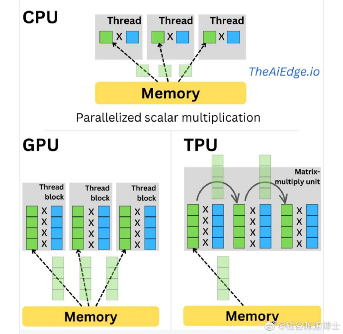

- [开发框架](#开发框架)
- [JS 开发框架](#js-开发框架)
- [13. 开发者体验 指南](#13-开发者体验-指南)
- [12. Trex：将非结构化数据转换为结构化数据的工具](#12-trex将非结构化数据转换为结构化数据的工具)
- [11. Diaphora：开源 程序diffing 分析 工具](#11-diaphora开源-程序diffing-分析-工具)
- [10. `科普` 《科普一下CPU, GPU和TPU》](#10-科普-科普一下cpu-gpu和tpu)
- [09. `教程` 《程序员对CPU缓存的误解》](#09-教程-程序员对cpu缓存的误解)
- [08. `观点` 任正非：末位淘汰的是领导，而非员工](#08-观点-任正非末位淘汰的是领导而非员工)
- [07. `观点` 技术栈：主流 \& 竞争力](#07-观点-技术栈主流--竞争力)
- [06. 目前 流行 的 AI开发栈](#06-目前-流行-的-ai开发栈)
- [05. Supabase](#05-supabase)
- [04. `Vercel` \& `Next.js`](#04-vercel--nextjs)
- [03. `Serverless` 无服务器框架](#03-serverless-无服务器框架)
- [02. 边缘函数 `Edge Compute`](#02-边缘函数-edge-compute)
- [01. `BaaS` 和 `CMS` 区别](#01-baas-和-cms-区别)

# 开发框架

+ 资源服务，用 `Next.js`
+ 后端服务，用 Python / JS + `Supabase`
+ 前端部署：`Vercel`
+ 后端部署：`Docker`

# [JS 开发框架](https://a16z.com/2023/06/21/the-getting-started-with-ai-stack-for-javascript/)

+ 授权: [Clerk](https://clerk.com/)
+ App 逻辑: [Next.js](https://nextjs.org/)
+ Vector database: [Pinecone](https://www.pinecone.io/) / [Supabase pgvector](https://supabase.com/docs/guides/database/extensions/pgvector)
+ LLM 编排: [Langchain.js](https://js.langchain.com/docs/get_started/introduction/)
+ Image model: [Replicate](https://replicate.com/)
+ Text model: [OpenAI](https://platform.openai.com/docs/models)
+ 部署: [Fly.io](https://fly.io/)

# 13. [开发者体验 指南](https://dx.phodal.com/)

开发者体验是开发人员对于针对使用或期望使用的产品、系统或者服务的认知印象和回应。关注的内容为库，SDK，文档，框架，开源解决方案，通用工具，API 等的开发人员的体验。

# 12. [Trex：将非结构化数据转换为结构化数据的工具](https://github.com/automorphic-ai/trex)

可以根据 正则表达式 或 上下文无关文法 智能地 重构数据 以 符合指定的模式

# 11. [Diaphora：开源 程序diffing 分析 工具](https://github.com/joxeankoret/diaphora)

源码 对比分析 工具

支持 汇编、控制流图、符号名 和 注释移植 等

支持 并行分析、伪代码启发式算法 等

# 10. `科普` [《科普一下CPU, GPU和TPU》](https://weibo.com/2194035935/N6AC29UZy)

CPU以迭代的方式处理标量数据，计算并行度低但是单核和单线程性能高，适合于通用和普通的计算任务。GPU和TPU支持高度并行化处理，GPU并行化向量点乘运算，TPU则优化和并行化矩阵乘法。

因为GPU需要通过多次向量点乘运算进行矩阵乘法，因此做矩阵乘法的性能不如TPU。有结果显示，TPU最多可以比GPU快5倍。因此TPU特别适合依赖矩阵乘法的大型深度学习模型。不过大多数机器学习模型并没有使用矩阵乘法实现，并不能真正利用TPU的矩阵乘法并行化能力。

使用TPU的一个问题是主流软件框架只有TensorFlow。PyTorch可以在上面运行，但功能、集成和稳定度都没法和TensorFlow比。另外，租用TPU 也很贵，v4机器的最低成本为12.88美元/小时，而Nvidia A100 GPU的4个GPU也才15.72美元/小时。

# 09. `教程` [《程序员对CPU缓存的误解》](https://software.rajivprab.com/2018/04/29/myths-programmers-believe-about-cpu-caches)

作为一名软件开发人员，你可能会想知道为什么要关注CPU缓存设计。

首先，缓存一致性的许多概念直接适用于分布式系统架构和数据库隔离级别。例如，了解硬件缓存中一致性是如何实现的，有助于更好地理解强一致性和最终一致性。它可以激发在分布式系统中如何更好地实施一致性的想法，使用相同的研究和原则应用于硬件。

其次，对缓存的误解经常导致错误的断言，特别是涉及并发和竞态条件的情况。例如，常见的说法是并发编程之所以困难是因为“不同的核心可能在各自的缓存中具有不同/过期的值”。或者我们需要在Java等语言中使用volatile的原因是为了“防止共享数据被本地缓存”，并强制将其“读/写到主内存”。这些误解大多是无害的（甚至可能有帮助），但也可能导致糟糕的设计决策。

# 08. `观点` 任正非：末位淘汰的是领导，而非员工

任正非：“看到教师末位淘汰制，让我想起了以前华为也搞过末位淘汰，淘汰了一段时间后发现，被淘汰掉的全是员工，但剩下来的员工越来越没有积极性了，后来我改变了方法，不淘汰员工了，专门把末位干部淘汰掉，华为把末位淘汰方案这么一改变以后，整过公司的员工立即都变得有积极性了"。

任正非的这番言论引起了人们的广泛讨论，他用华为的末位淘汰政策的变化来说明了一个很重要的问题：仅仅淘汰员工是不足以提高公司的绩效的。他认为，真正能够提高公司业绩的是淘汰末位干部。这个观点不禁让人想起一个著名的笑话：如果要淘汰不负责任的员工，最好的方法就是升职加薪，让他们成为经理。

其实，这观点并不是空穴来风。在企业管理中，一些领导者会认为只有淘汰不称职的员工才能提高公司的业绩。但实际上，淘汰员工并不能解决根本问题。因为这些员工很可能是受到公司管理的影响，没有得到充分的培训和指导。此外，淘汰员工也可能会导致公司的人员流失和士气下降。

相反，任正非提出的淘汰末位干部的方法则更具有实际可行性。因为末位干部往往是对公司产生负面影响的人。他们可能是没有适应公司变化的能力，或者是没有正确领导团队的能力。因此，淘汰末位干部可以促进公司的整体进步。

# 07. `观点` 技术栈：主流 & 竞争力

选择主流技术栈一定是最稳妥的选择么？ 

在很多非技术公司，快速招聘到一个程序员能继续维护系统可能高于其他因素，那么选择主流技术栈是个不错的选择。

但主流技术意味着缺少竞争力。在众多行业中，成本优势往往是极大的竞争力，而互联网It在以前因为属于高速增长的行业，增长会比成本更重要。但这个行业也要泯然众人矣，慢慢进入成本环节。

2009 年 March 收购 OKCupid，前者150台服务器，而后者只用了4台服务器就服务了10倍的客户。

再过些年，国内迟早要进入该模式，随着优秀程序员开始供给充足，企业竞争进入精细化阶段，通过少数程序员就能快速降低硬件以及管理成本会变的很重要。

所以，还是要好好学习技术

# 06. 目前 流行 的 AI开发栈

|领域|库|语言|
|--|--|--|
|服务器逻辑 `API`|[FastAPI](https://fastapi.tiangolo.com/)|Python|
|前端 / 资源服务|[Next.js](https://github.com/vercel/next.js/)|JS|
|应用部署平台|[Vercel](https://vercel.com/)|JS|
|授权|[nextauth.js](https://next-auth.js.org/)|JS|
|限速 RateLimit|[upstash](https://github.com/upstash/ratelimit)|JS|
|`LLM`|[Langchain](https://github.com/hwchase17/langchain)|Python|
|`LLM`|[Vercel AI SDK](https://vercel.com/blog/introducing-the-vercel-ai-sdk)|JS|
|向量数据库|[Pinecone](https://www.pinecone.io/)|闭源：疑似Rust实现|
|数据库|[SnowflakeDB](https://docs.snowflake.com/en/sql-reference/snowflake-db): 云端 数据库|Python/JS|
|Web数据分析|[umami](https://umami.is/)|JS|
  
# 05. [Supabase](https://github.com/supabase/supabase)

部署私有库:

+ [官方: 通过 Docker 部署](https://supabase.com/docs/guides/self-hosting/docker)
+ [官方说明](https://supabase.com/docs/guides/self-hosting)
+ [知乎文章](https://zhuanlan.zhihu.com/p/633443402)

`Supabase` 是 `Firebase` 的开源替代品，一个 后端及服务（`BaaS`，Backend as a Service）平台

功能：

+ Database: Postgres + pgvector
+ Auth: 身份验证 和 授权，`JWT`
+ 自动生成 API: Rest / GraphQL / 实施订阅（基于 WebSocket）
+ 边缘函数
+ 文件存储: 上传 / 下载 文件 http-api

库：

+ 网关-路由
    - `Kong` 是云原生 API网关
+ 功能
    - **/auth**: GoTrue，是 基于 `SWT` 的 API，用于管理用户和发行 `SWT` 令牌。
    - **/rest**: PostgRest，是 Web 服务器，可将 PostgreSQL 数据库直接转换为 RESTful API
    - **/realtime**: Realtime 是 Elixir 服务器，用 websockets 监听 PostgreSQL 插入、更新和删除，将 JSON 广播给授权客户端。
    - **/storage**: Storage，使用 RESTful 接口 管理 存储在 S3 中的文件
    - **/pg**: pg-meta, 用于管理 Postgres 的 RESTful API，允许您获取表、添加角色和运行查询等。
    - **/funcitons**: Funtions，边缘函数
+ 存储
    - `PostgreSQL` 
    - `pg_graphql` 一个公开 GraphQL API 的 PostgreSQL 扩展

# 04. `Vercel` & `Next.js`

`Jamstack` 动态生成的内容 显示在 静态交付的网站上，例如从静态托管或 CDN（内容交付网络）提供 HTML。首字母缩略词 `JAM` 代表网页的组件： Javascript、APIs 和 Markup；流程：Client -- CDN -- FaaS API

`Vercel`：开发、预览 和 部署 Web应用 的 云平台；为前端和全站开发者服务；适合部署`JAMstack`架构应用

主要解决：

+ 简化 部署流程：将代码库连接到平台进行自动部署；
+ 实时预览：每次提交，自动创建实时预览；
+ 边缘网络：Vercel具有全球CDN，进行内容分发；

Next.js: Vercel团队维护的，Node的开源React前端框架

提供了 预渲染、服务器渲染、静态生成 等

Next.js主要解决：

+ 服务器渲染 / 静态生成，改善SEO（搜索引擎优化）
+ 预渲染：预渲染页面可以在服务器上生成HTML
+ 页面路由
+ API路由: 在pages/api目录下创建API路由
+ 快速刷新: 支持React Fast Refresh

# 03. `Serverless` 无服务器框架

`FaaS`：函数即服务，Function as a Service，都是 Serverless 函数 平台 提供的功能，底层 依赖于 `BaaS`；

减少 部署 & 运维 成本，专注 开发构建应用。

不需要担心服务器的 规模、性能、安全性、可用性 等问题。

+ 冷启动问题：函数需要在请求到达时才启动，导致性能问题，目前都已经得到改进。
+ 成本：按使用量计费，而不是预先分配资源；如果有很大的流量波动或长时间空闲，就很划算。
+ 控制权和可移植性：担心依赖某个平台；但是，有很多工具和技术可以解决这类问题，比如 `Kubernetes` 和 `OpenFaaS`。

# 02. 边缘函数 `Edge Compute`

优化云计算系统 性能 的 方法，将数据处理任务 靠近 数据源的地方 执行，从而减少延迟和带宽使用。

对于实时应用（游戏、流媒体服务、物联网设备 等）非常有用。

+ 类似 `CDN` 在 资源下载 的地位
+ 目的：减少物理距离，降低 延迟；

支持平台：

+ `AWS Lambda`
+ Google Cloud
+ Microsoft Azure Function
+ `Cloudflare` Workers 全球CDN网络 部署 和 复制
+ `Vercel`边缘功能，聚焦在 前端开发 和 JAMstack 架构
+ `Netlify Edge`: Deno提供，静态网站托管 和 部署
+ `Supabase Functions`: 用Deno构建
+ 阿里 Link IoT Edge

框架：

+ Vercel `Next.js`，支持Vercel边缘功能，Netlify的边缘功能
+ Deno 部署 能 在边缘 即时部署 TS/JS/Wasm 代码
    - Supabase Function 和 Netlify Edge 是用 Deno 构建的。

# 01. `BaaS` 和 `CMS` 区别

CMS（Content Management System）内容管理系统，比如：WordPress

+ 内容创建
+ 内容存储
+ 工作流管理
+ 发布

区别：

+ `CMS` 专注于 内容管理；
+ `BaaS` 专注于 后端功能，让开发人员专注前端；