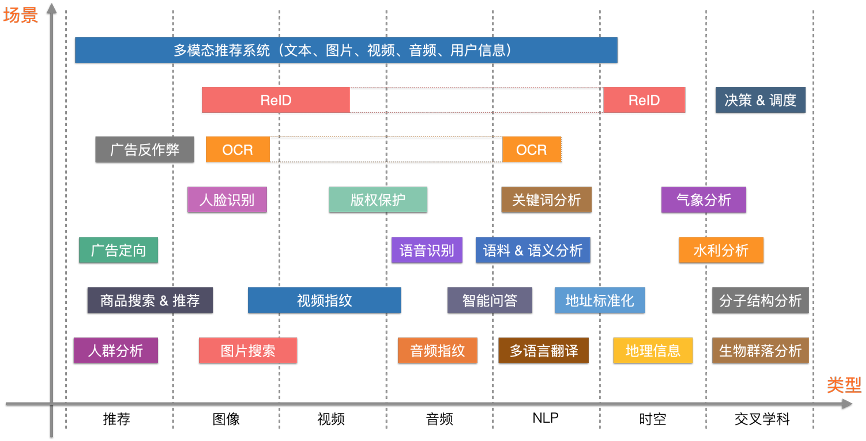
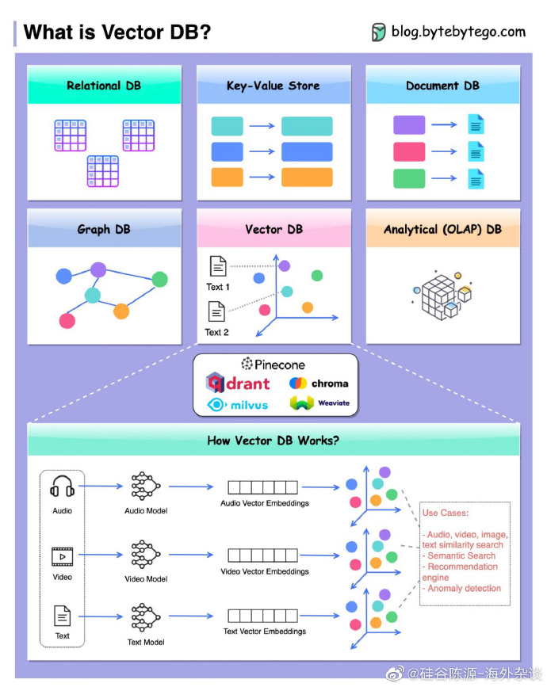
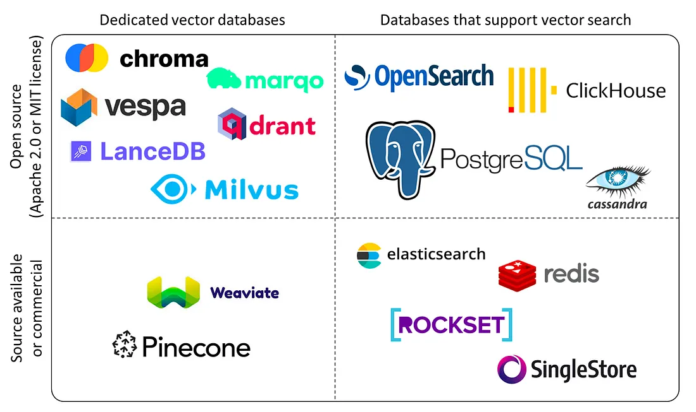

- [向量数据库](#向量数据库)
- [11. Speedy Semantic Search：用 Qdrant 向量搜索引擎在几毫秒内进行语义搜索，包括python 和 Rust 版本](#11-speedy-semantic-search用-qdrant-向量搜索引擎在几毫秒内进行语义搜索包括python-和-rust-版本)
- [10. 《ChatGPT盛行的当下，向量数据库为大模型配备了一个超级大脑》](#10-chatgpt盛行的当下向量数据库为大模型配备了一个超级大脑)
- [09. 《向量数据库》](#09-向量数据库)
- [08. tinyvector: SQLite \& Pytorch](#08-tinyvector-sqlite--pytorch)
- [07. 技术文章系列: Qdrant中的向量数据库](#07-技术文章系列-qdrant中的向量数据库)
- [06. 推荐系统 的 向量检索 解析](#06-推荐系统-的-向量检索-解析)
- [05. 在Rust中用一周编矢量数据库](#05-在rust中用一周编矢量数据库)
- [04. 用200行Rust代码写一个向量搜索数据库](#04-用200行rust代码写一个向量搜索数据库)
- [03. 技术文：BERT, ELMo, \& GPT-2: How Contextual are Contextualized Word Representations?](#03-技术文bert-elmo--gpt-2-how-contextual-are-contextualized-word-representations)
- [02. 当我们谈论向量数据库时我们在谈论什么](#02-当我们谈论向量数据库时我们在谈论什么)
- [01. 《为什么你不应该投资 向量数据库》](#01-为什么你不应该投资-向量数据库)

# 向量数据库

概念：

+ 向量: 高维空间的一个点
+ 以向量为索引
+ 非结构化数据: 文本，图像，音频，视频

应用: 

+ 聚类
+ 推荐
+ 相似性搜索
+ 语义搜索

|名称|开/闭源|实现语言|说明|
|--|--|--|--|
|`Qdrant`|开源源|Rust||
|`Weaviate`|开源|Go||
|`Milvus`|开源|Go||
|`Pineone`|闭源|貌似 Rust||

技术：

+ kd 树
+ LSH 局部敏感 Hash
+ 量化: 减少搜索空间，压缩向量
+ ANN 近似算法
+ 大规模
    - 分布式: 一致性，可靠性，分区容错性

# 11. [Speedy Semantic Search：用 Qdrant 向量搜索引擎在几毫秒内进行语义搜索，包括python 和 Rust 版本](https://github.com/qdrant/page-search)

# 10. [《ChatGPT盛行的当下，向量数据库为大模型配备了一个超级大脑》](https://weibo.com/ttarticle/p/show?id=2309404927478916579535)

# 09. [《向量数据库》](https://guangzhengli.com/blog/zh/vector-database/)

介绍了向量数据库在解决人工智能模型限制方面的重要性。随着AI应用的蓬勃发展，向量数据库成为了热门话题之一。文章解释了向量数据库的核心思想，即将文本转换成向量并存储在数据库中，通过向量之间的相似性搜索实现高效的问题解答和文本理解。向量数据库在解决GPT模型输入端token限制、计算量和成本等问题上发挥了重要作用，并在语义搜索和AI领域有广泛应用

# 08. [tinyvector: SQLite & Pytorch](https://github.com/0hq/tinyvector)

tinyvector：用SQLite和PyTorch构建的微型最近邻嵌入数据库，一个快速、轻量的向量嵌入数据库，具有可定制性强、易于扩展等特点

# 07. [技术文章系列: Qdrant中的向量数据库](https://qdrant.tech/articles/)

# 06. [推荐系统 的 向量检索 解析](https://zhuanlan.zhihu.com/p/462483802)

# 05. [在Rust中用一周编矢量数据库](http://www.cheeli.com.cn/articles/writing-a-vector-database-in-a-week-in-rust/)

+ [TerminusDB](https://terminusdb.com/): 图数据库 的 CMS 
+ [VectorLink: The TerminusDB Semantic Indexer](https://github.com/terminusdb-labs/terminusdb-semantic-indexer)

# 04. [用200行Rust代码写一个向量搜索数据库](https://fennel.ai/blog/vector-search-in-200-lines-of-rust/)

由于人工智能/机器学习的快速发展，向量数据库随处可见。虽然它们可以支持复杂的人工智能/机器学习应用，但向量搜索本身在概念上并不那么困难。在本文中，我们将介绍向量数据库的工作原理，并在不到200行Rust代码中构建一个简单的向量搜索库。所有的代码都可以在这个Github仓库中找到。我们在这里使用的方法基于一类名为"局部敏感哈希"的算法，这是流行库annoy中使用的算法。本文的目标不是介绍一个新的花哨算法/库，而是通过实际代码片段描述向量搜索的工作原理。

# 03. [技术文：BERT, ELMo, & GPT-2: How Contextual are Contextualized Word Representations?](https://ai.stanford.edu/blog/contextual/?continueFlag=b1051ae9d3cb887d3ed8db100ded152c)

通过数据分析解释了几个概念，通过这些对比，可以更具体和深入的理解什么是词的Embedding Vector，以级不同 Embedding 之间的差异到底是什么。

* 词的静态嵌入向量 static embedding
* 词的上下文嵌入向量(更强语义) contextual embedding
* contextual embedding里面的 anisotropic (各向异性）就是不同词上下文不一样时，embedded 向量有很大差异
* 在Bert/GPT的NN层里， 每一层的向量都可以是次的 embedding，越靠近低层的，越接近次的 static embeddeing，越靠近高层词的 contextual 信息越多。
* 一个词的所有 contextual embedding 是潜入词向量空间中的一个小圆锥，同一个词的所有 contextual embedding 的加权平均，可以计算 Self-Similarity(SelfSim)
* 一个句子内多个词的 contextual embedding 和均值向量之间的 cos 的加权平均可以计算出一个句子的 Intra-Sentence Similariry 
* 如果一个句子的 Intra-Sentence Similariry  很小，但是句子里的词的 Self-Similarity 很大，那就说明 contextual embedding 表征不够好
* 如果一个句子的 Intra-Sentence Similariry  很大，那么句子里的词的 Self-Similarity 很大，则是合理的
* Elmo、Bert、GPT 每一层的词的向量的随机平均，随着层的增加，基本都是上升的，Bert是从小到大，GPT2变化比较缓慢
* Elmo、Bert、GPT 每一层的词的向量的Self-Sim, 随着层的增加，都是下降的，说明越高层，上下文语义导致词的不同上下文下的表征差异越大
* Elmo、Bert、GPT 每一层的词的向量的Intra-Sentence Similarity ，句子内的词的向量，随着层的增加，Elmo越高层句子内的词越相近；Bert越高层句子内的词也越接近但是比较平稳同时比随机词之间更相似；GPT句子内的词则越高层越不相似。
* 取 Elmo、Bert、GTP底层的词向量的主成分，可以作为一种新的Static Embedding，比传统的Word2Vector、Glove、FastText等静态词向量在各种评测中效果都更好。收起

# 02. [当我们谈论向量数据库时我们在谈论什么](https://zhuanlan.zhihu.com/p/634361464)

作为 LLM 的 Long-Term Memory

数据库：

+ CRUD: 增删查改
+ 持久化

向量搜索库: `Faiss`，`SPTAG` 基于内存，不支持持久化，没法增删数据

**方案1**：基于高性能的向量搜索库，开发持久化存储引擎

例子：

+ `ChromaDB`，用 `DuckDB` 和 `Clickhouse` 来做持久化
+ 第一代 `Milvus`，实现了 算存隔离的分布式；

难点：

+ 保证写一致性
+ 保证隔离性
+ 处理分布式

**方案2**：基于现有数据库，提供向量查询

例子：

+ `pgvector`，基于`PostgreSQL`的 向量拓展

难点：

目前主流的向量`KNN`/`ANN`搜索index都是基于in-memory的假设设计的，把这些index直接应用到一个基于硬盘的系统，可能会有性能上的下降。

**方案3**：从头开发一个

例子：

+ `Manu`: Milvus 2.0
+ `Weaviate`

**闭源**：例子 `Pinecone`

# 01. [《为什么你不应该投资 向量数据库》](https://medium.com/data-engineer-things/why-you-shouldnt-invest-in-vector-databases-c0cd3f59d23c)

如果业务上面临大量需要高级矢量搜索功能，推荐开源的向量数据库；

如果业务已采用Elastic、Redis、SingleStore或Rockset等数据库并且不需要高级的搜索和推荐功能，就用现在数据库的vector支持，这些数据库迟早要支持向量的。

以 PostgreSQL  为例子，它本来就擅长 擅长事务处理（例如CockroachDB）、在线分析（例如DuckDB）、流处理（例如RisingWave）、时间序列分析（例如Timescale）、空间分析（例如PostGIS）等，比从头开发的向量数据库的专用功能（缺少上诉的功能支持），要好上不少。
